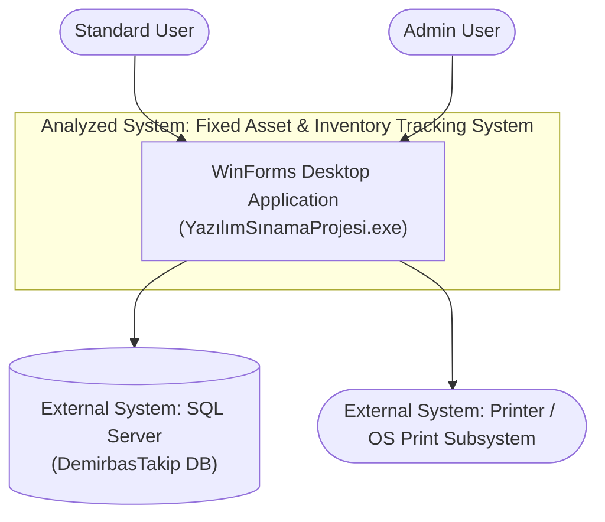
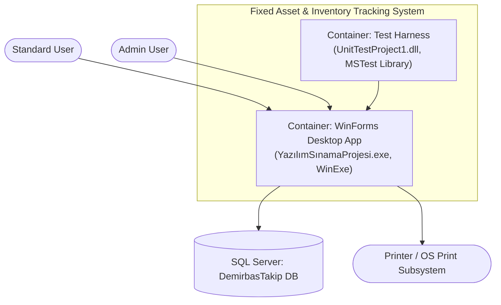
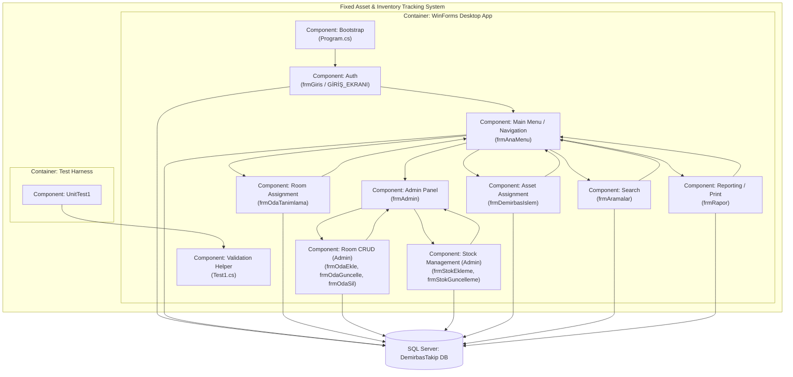
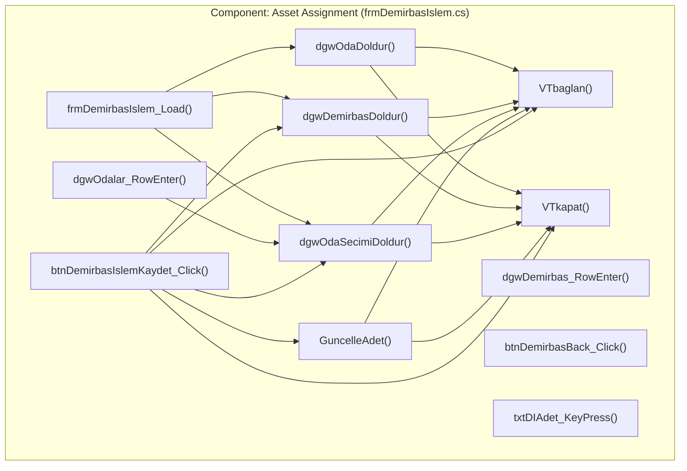

# Architecture Report: Fixed Asset & Inventory Tracking System (YazılımSınamaProjesi / DemirbasTakip)

**Path analyzed:** C:\Users\MohamedRaashidBISTEC\OneDrive - BISTEC Global\Documents\specclaw project\InventoryTrackingSystem\InventoryTrackingSystem
**Date analyzed:** 2026-08-18

## System Context (L1)

The analyzed system is a single-user-session Windows desktop executable. `YazılımSınamaProjesi/YazılımSınamaProjesi.csproj` declares `<OutputType>WinExe</OutputType>` and `<TargetFrameworkVersion>v4.5</TargetFrameworkVersion>`; `Program.cs`'s `Main()` is a classic WinForms bootstrap (`Application.EnableVisualStyles(); ... GİRİŞ_EKRANI giris = new GİRİŞ_EKRANI(); giris.Show(); Application.Run();`), confirming the system boundary is exactly this one executable, not a client/server split.

Two distinct human actors interact with the system, both through the same login screen but differentiated post-login: a **Standard User** (any row in `tblKullanicilar` that authenticates) and an **Admin User** — `frmAnaMenu.cs`'s `ANA_MENÜ_Load` runs `SELECT YetkiID FROM tblKullanicilar WHERE KullaniciAdi=... AND Sifre=...` and does `if(yetki=="True") btnAdmin.Enabled = true; else btnAdmin.Enabled = false;`, i.e. the admin-only "Admin Panel" entry point is gated by a per-user permission flag, not a separate login flow.

The system has one external system dependency confirmed by direct file inspection: a **SQL Server database** (`Initial Catalog=DemirbasTakip`). Every data-access form I opened (`frmGiris.cs`, `frmAnaMenu.cs`, `frmDemirbasIslem.cs`, `frmAramalar.cs`, `frmOdaTanimlama.cs`, `frmOdaEkle.cs`, `frmOdaGuncelle.cs`, `frmOdaSil.cs`, `frmStokEkleme.cs`, `frmStokGuncelleme.cs`, `frmRapor.cs`) opens its own `SqlConnection` to the identical literal `"server=localhost,1433;Initial Catalog=DemirbasTakip;User Id=sa;Password=DemirbasDev!2026;TrustServerCertificate=True"`. ⚠ PROVISIONAL — pending PQ-002 (proposed default: SQL Server runs on a separate host from the WinForms client, not co-located, despite the "localhost" literal) regarding whether this implies a co-located deployment.

A second external system — a **printer / the OS print subsystem** — is used by the reporting screen. `frmRapor.cs`'s `btnYazdir_Click` renders the report `DataGridView` to a `Bitmap` (`dgwRapor.DrawToBitmap(bmp, ...)`) and calls `PpdDialog.ShowDialog()` (a `PrintDialog` control) before `PDYazici_PrintPage` draws that bitmap via `e.Graphics.DrawImage(bmp, 0, 0)` — i.e. the app performs client-side print rendering, handed off to Windows' print subsystem.

No other outbound integration was found: `YazılımSınamaProjesi.csproj` references `System.Net.Http` and a `itextsharp` HintPath, but no file I opened uses an `HttpClient` or an `iTextSharp` namespace — these are unused/vestigial references (the `itextsharp.dll` the csproj points to was already confirmed absent from this checkout in the prior codebase report), so neither is included as an L1 external actor since I found no code path exercising them.

## Containers (L2)

Two deployable/compiled units exist in this repository. **`YazılımSınamaProjesi.csproj`** (`<OutputType>WinExe</OutputType>`, `RootNamespace` `YazılımSınamaProjesi`) is the primary container — the interactive desktop application containing every `frm*.cs` screen, `Program.cs`, and `Test1.cs`. **`UnitTestProject1.csproj`** (`<OutputType>Library</OutputType>`, `RootNamespace` `UnitTestProject1`) is a separate compiled container — a legacy MSTest test harness. The collected `dependency_graph` confirms the relationship at the project level: `{"from": "UnitTestProject1/UnitTestProject1.csproj", "to": "YazılımSınamaProjesi/YazılımSınamaProjesi.csproj", "kind": "project_reference"}`, and `UnitTestProject1.csproj`'s own XML confirms this (`<ProjectReference Include="..\YazılımSınamaProjesi\YazılımSınamaProjesi.csproj">`). I opened `UnitTestProject1/UnitTest1.cs` directly and confirmed it exercises exactly one class from the app container: `using YazılımSınamaProjesi; ... Test1 t = new Test1(); t.FiyatDogruMu(...)`.

The **SQL Server database** container sits outside the analyzed system's own build output but is a necessary runtime dependency — confirmed by the hardcoded `Initial Catalog=DemirbasTakip` connection string repeated in every data-access form, and by `top_level_dirs` listing `DemirbasTakip.mdf`/`DemirbasTakip_log.ldf` (a SQL Server primary data file and transaction log) directly in the repository root. ⚠ PROVISIONAL — pending PQ-001 (proposed default: these `.mdf`/`.ldf` files are a disposable local-dev artifact, not a container the rebuild target must reproduce one-to-one) regarding whether this file pair represents the actual deployed database or an accidentally-committed dev snapshot.

The **Printer / OS Print Subsystem** is not a container of this system — it is an external system consumed only by `frmRapor.cs`'s `btnYazdir_Click`/`PpdDialog` as described in L1.

No web server, background worker/service, message queue, or additional API-layer container was found anywhere in `top_level_dirs`, the manifests, or any file I opened — this is consistent with the README's own description: "The project follows a **classic Windows Forms architecture**, where each screen is represented by its own Form (`frm*.cs`)."

## Components (L3)

I opened all ten `frm*.cs` files plus `Program.cs` and `Test1.cs`/`UnitTest1.cs` in this run to confirm every component boundary and edge below; there is no repository-provided component-dependency graph for C#/WinForms (the collected `dependency_graph` only carries the one project-level edge covered in L2), so every L3 edge here is grounded in a navigation call I read directly.

- **Bootstrap** (`Program.cs`) constructs and shows the login form: `GİRİŞ_EKRANI giris = new GİRİŞ_EKRANI(); giris.Show();`.
- **Auth** (`frmGiris.cs`, class `GİRİŞ_EKRANI`) runs the login query and, on success, opens **Main Menu**: `frmAnaMenu anamenu = new frmAnaMenu(this); anamenu.Show();`. It exposes `public static string kAdi, sifre;` — these static fields are how the authenticated username/password are smuggled into `frmAnaMenu`'s own authorization re-check rather than being passed as a typed session object.
- **Main Menu / Navigation** (`frmAnaMenu.cs`) is the app's navigation hub: its constructor takes the previous form and closes it (`public frmAnaMenu(Form f) { InitializeComponent(); f.Close(); }`), and its five button handlers route to **Search** (`frmAramalar`), **Asset Assignment** (`frmDemirbasIslem`), **Room Assignment** (`frmOdaTanimlama`), **Admin Panel** (`frmAdmin`), and **Reporting** (`frmRapor`) — each via `new frmX(); frmX.Show(); this.Hide();`. It also re-queries `tblKullanicilar` on load to gate `btnAdmin.Enabled`.
- **Admin Panel** (`frmAdmin.cs`) has no direct database access of its own (no `SqlConnection` field) — it is a pure routing screen gating five admin-only child screens: `frmStokEkleme`, `frmStokGuncelleme`, `frmOdaSil`, `frmOdaEkle`, `frmOdaGuncelle`, each via `new frmX(); frmX.Show(); this.Hide();`.
- **Room Assignment** (`frmOdaTanimlama.cs`) — reachable directly from Main Menu (not admin-gated) — assigns a `PersonelID` to an `OdaID` via `insert into tblOdaDemirbasAtama(OdaID,PersonelID)`.
- **Room CRUD (Admin)** (`frmOdaEkle.cs`, `frmOdaGuncelle.cs`, `frmOdaSil.cs`) — grouped as one component because all three are reachable only from Admin Panel, share the near-identical `ComboboxDoldur()`/`VTbaglan()`/`VTkapat()` pattern I confirmed in each file, and all target `tblOda` (insert/update/delete respectively). `frmOdaEkle.cs` additionally reads a `tblDepartmanlar` lookup table (`SELECT *FROM tblDepartmanlar`) not referenced by any other component I opened.
- **Stock Management (Admin)** (`frmStokEkleme.cs`, `frmStokGuncelleme.cs`) — grouped together because both are admin-gated, both read a `tblDemirbasTurleri` lookup list, and both insert/update `tblDemirbas` (asset-type stock records).
- **Asset Assignment** (`frmDemirbasIslem.cs`) — reachable directly from Main Menu — assigns a purchased asset (`tblDemirbas`) to a room (`tblOda`) via `tblOdaDemirbasAtama`, and decrements the source stock quantity (`GuncelleAdet()`'s `UPDATE tblDemirbas SET Adet=@adet ... `). This is the most stateful component in the container (six data-holding fields: `ds, ds1, ds2, da, da1, da2`) — see L4 below.
- **Search** (`frmAramalar.cs`) — reachable directly from Main Menu — offers five mutually-exclusive filtered searches over `tblDemirbas`/`tblDemirbasTurleri` (by name/type/price/purchase-date/quantity, selected via radio buttons) plus a personnel-name search over `tblPersonel`/`tblOdaDemirbasAtama`.
- **Reporting / Print** (`frmRapor.cs`) — reachable directly from Main Menu — joins `tblOda`/`tblOdaDemirbasAtama`/`tblPersonel`/`tblDemirbas` filtered by a selected room, and renders the resulting grid to a printable bitmap (see L1).
- **Validation Helper** (`Test1.cs`) — a standalone, non-Form class (`FiyatDogruMu`/`IsNumeric`) with no constructor dependencies on any `frm*` file — I found no reference to it from any of the ten forms I opened; its only caller is `UnitTestProject1/UnitTest1.cs` in the separate Test Harness container.

**Data-access duplication, confirmed across the container:** every DB-touching component redefines its own `VTbaglan()`/`VTkapat()` pair and the identical hardcoded connection string rather than sharing one data-access component — I confirmed this by direct comparison of the method bodies in all ten forms listed above. There is no service/repository layer component in this container; each screen is its own data-access unit, matching the brief's stated architecture.

**Inconsistent query safety across components, confirmed directly:** Auth's login query (`frmGiris.cs`) and Main Menu's authorization re-check (`frmAnaMenu.cs`) both build SQL via raw string concatenation of user input (`"...WHERE KullaniciAdi='" + kAdi + "' AND Sifre='" + sifre + "'"`), as does Search's ad-hoc filter query and Reporting's per-room filter query. By contrast, every insert/update in Room Assignment, Room CRUD, Stock Management, and Asset Assignment correctly uses `SqlCommand.Parameters.AddWithValue`. This is an internal inconsistency within otherwise-similar components, not a boundary ambiguity, so it is reported as a finding here rather than raised as a pending question.

## Code (L4)

**L4 produced for: Asset Assignment (`frmDemirbasIslem.cs`).** This component meets two of the L4 Judgment Rule's criteria: it is the most stateful component in the container (`DataSet ds, ds1, ds2; SqlDataAdapter da, da1, da2; string odaID, demirbasID, personelID; int Alinanadet, stok;` — six data-holding fields plus three ID-tracking strings, versus one or two in every other component I opened), and its core transaction (`btnDemirbasIslemKaydet_Click`) is the single business operation that touches three tables in one user action (insert into `tblOdaDemirbasAtama`, then `GuncelleAdet()`'s `UPDATE tblDemirbas`), making it the most likely first target for a rebuild/onboarding effort per the domain's own core workflow (assigning a fixed asset to a room and decrementing its stock count).

Grounded in the file directly: `frmDemirbasIslem_Load` calls `dgwOdaDoldur()`, `dgwDemirbasDoldur()`, and `dgwOdaSecimiDoldur()` in sequence on form load. `dgwOdalar_RowEnter` (fired when a row in the room grid is selected) sets `odaID`/`personelID` from the bound `DataSet` and re-calls `dgwOdaSecimiDoldur()`. `dgwDemirbas_RowEnter` (asset grid row selection) sets `demirbasID` and the in-memory `stok` count read from the grid, with no DB call. `btnDemirbasIslemKaydet_Click` first validates `txtDIAdet.Text` is non-empty and numeric-parseable, checks `Alinanadet > stok` (in-memory guard against over-issuing from stock), then — only on success — runs the parameterized insert, calls `GuncelleAdet()` (which re-opens its own connection to run `UPDATE tblDemirbas SET Adet=@adet WHERE DemirbasID=@demirbasID` with `@adet` computed as `(stok - Alinanadet)`), and finally refreshes both grids (`dgwDemirbasDoldur()`, `dgwOdaSecimiDoldur()`). Every one of the four data/query methods (`dgwOdaDoldur`, `dgwDemirbasDoldur`, `dgwOdaSecimiDoldur`, `GuncelleAdet`) opens and closes its own connection via the shared `VTbaglan()`/`VTkapat()` pair rather than reusing one open connection across the sequence of calls inside `btnDemirbasIslemKaydet_Click` — i.e. one user click opens and closes the database connection three separate times in immediate succession (once each for the insert, `GuncelleAdet()`, and the two refresh calls share connections independently). `btnDemirbasBack_Click` returns to Main Menu via `new frmAnaMenu(this)` (whose constructor closes `this`, per the Main Menu component description in L3). `txtDIAdet_KeyPress` is a pure input-filter guard (digits/backspace/comma only) with no data access.

For every other component in this container and in the Test Harness container, L4 not warranted for this component:
- Bootstrap (`Program.cs`) — L4 not warranted for this component.
- Auth (`frmGiris.cs`) — L4 not warranted for this component.
- Main Menu / Navigation (`frmAnaMenu.cs`) — L4 not warranted for this component.
- Admin Panel (`frmAdmin.cs`) — L4 not warranted for this component.
- Room Assignment (`frmOdaTanimlama.cs`) — L4 not warranted for this component.
- Room CRUD (Admin) (`frmOdaEkle.cs`, `frmOdaGuncelle.cs`, `frmOdaSil.cs`) — L4 not warranted for this component.
- Stock Management (Admin) (`frmStokEkleme.cs`, `frmStokGuncelleme.cs`) — L4 not warranted for this component.
- Search (`frmAramalar.cs`) — L4 not warranted for this component.
- Reporting / Print (`frmRapor.cs`) — L4 not warranted for this component.
- Validation Helper (`Test1.cs`) — L4 not warranted for this component.
- UnitTest1 (Test Harness container) — L4 not warranted for this component.
