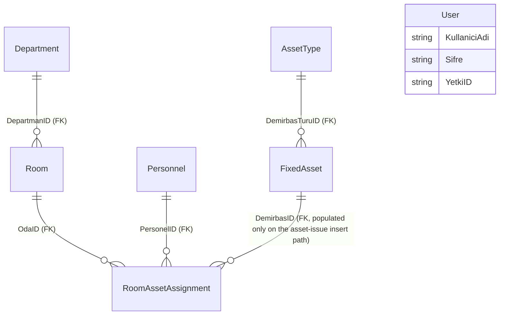

# Domain Model: Fixed Asset & Inventory Tracking System (YazılımSınamaProjesi / DemirbasTakip)

**Path analyzed:** C:\Users\MohamedRaashidBISTEC\OneDrive - BISTEC Global\Documents\specclaw project\InventoryTrackingSystem\InventoryTrackingSystem
**Date analyzed:** 2026-08-18

## Entities

**Stack note:** the collector's stack-specific fields (`type_declarations[]`, `validation_routine_candidates[]`, `forms[]`, etc.) all came back empty because this collector's parsers target Delphi/.dfm and XAML shapes, not a C#/WinForms codebase. Every entity below is instead derived directly from `Read`ing the ten `frm*.cs` files and their `.Designer.cs` counterparts — there are no C# domain/POCO classes anywhere in scope (`type_declarations` would be empty even for a C#-aware collector): every entity exists only as a SQL table/column name referenced inline inside `SqlCommand`/`SqlDataAdapter` strings in the forms themselves. Field lists below are therefore bounded by the columns actually named in a `SELECT`/`INSERT`/`UPDATE` I opened — no DDL/schema file was in scope to confirm the complete real column set, nullability, or constraints (see PQ-001 on the checked-in `.mdf`/`.ldf` pair).

### User (`tblKullanicilar`)
- **Fields observed:** `KullaniciAdi` (username), `Sifre` (password, stored/compared as plain text), `YetkiID` (authorization flag).
- **Field semantics:** `YetkiID` is read and compared as a string literal `"True"`/`"False"` (`frmAnaMenu.cs`: `if(yetki=="True") btnAdmin.Enabled = true;`) — i.e. a constrained two-value literal set standing in for a proper boolean/enum column, not free text. See Enumerations below.
- **Inference:** represents a login account with a two-tier (standard/admin) authorization level.
- **Evidence:** `frmGiris.cs` (`"SELECT COUNT(*) FROM tblKullanicilar WHERE KullaniciAdi='" + kAdi + "' AND Sifre='" + sifre + "'"`), `frmAnaMenu.cs` (`"SELECT YetkiID FROM tblKullanicilar WHERE KullaniciAdi='" + k + "' AND Sifre='" + s + "'"`).
- **Named Gap:** no screen in scope creates, edits, or lists `tblKullanicilar` rows — accounts and their `YetkiID` must be provisioned directly against the database outside this application.

### Room (`tblOda`)
- **Fields observed:** `OdaID` (primary key, implied by every join/select projecting it), `OdaAdi` (room name), `DepartmanID` (foreign key to Department).
- **Inference:** a physical room/space that can have fixed assets issued into it and a responsible staff member assigned to it.
- **Evidence:** `frmOdaEkle.cs` (`"insert into tblOda(OdaAdi,DepartmanID) values (@odaAdi,@ID)"`), `frmOdaGuncelle.cs` (`"UPDATE tblOda SET OdaAdi=@odaAdi WHERE OdaAdi=@EodaAdi "`), `frmOdaSil.cs` (`"DELETE FROM tblOda WHERE OdaAdi=@odaAdi "`), `frmOdaTanimlama.cs` (`"SELECT OdaID,OdaAdi FROM tblOda"`).
- **Named Gap / ⚠ PROVISIONAL — pending PQ-004 (proposed default: preserve name-keyed UPDATE/DELETE as-is for baseline fidelity):** the Update and Delete screens both key their statement on `OdaAdi` (name) rather than `OdaID` (primary key), unlike every other CRUD screen in this codebase, which keys by ID.

### Department (`tblDepartmanlar`)
- **Fields observed:** `DepartmanID`, `DepartmanAdi` (department name).
- **Inference:** an organizational department a room belongs to.
- **Evidence:** `frmOdaEkle.cs` (`frmOdaEkle_Load`: `"SELECT *FROM tblDepartmanlar"`, populating `lboxDepartmanID`/`lboxDepartmanAdi`).
- **Named Gap:** no screen in scope creates, edits, or deletes `tblDepartmanlar` rows — read-only lookup, populated outside this application.

### Personnel (`tblPersonel`)
- **Fields observed:** `PersonelID`, `PersonelAdi` (first name), `PersonelSoyadi` (last name).
- **Inference:** a staff member who can be made responsible for a room and/or associated with an issued asset.
- **Evidence:** `frmOdaTanimlama.cs` (`"SELECT PersonelID,PersonelAdi,PersonelSoyadi FROM tblPersonel"`), `frmAramalar.cs` (personnel-name search joins), `frmRapor.cs`, `frmDemirbasIslem.cs` (`dgwOdaDoldur` join).
- **Named Gap:** no screen in scope creates, edits, or deletes `tblPersonel` rows — read-only lookup, populated outside this application.
- **⚠ PROVISIONAL — pending PQ-006 (proposed default: owned by Room Management / MOD-002):** which module owns this entity is contested between Room Management and Asset Assignment & Stock — see module-map.md.

### FixedAsset ("Demirbaş", `tblDemirbas`)
- **Fields observed:** `DemirbasID` (primary key), `DemirbasAdi` (asset name), `Fiyat` (price, passed through as a raw string via `AddWithValue` with no numeric parsing anywhere in scope), `AlimTarihi` (purchase date), `DemirbasTuruID` (foreign key to AssetType), `Adet` (quantity/stock count on hand).
- **Field semantics:** `Fiyat` is captured as free-typed text (digit/comma keypress-filtered only — see DR-005) and stored/queried as a string throughout; no code path in scope ever parses it to a numeric type, so its true stored column type could not be confirmed from the app code alone.
- **Inference:** a fixed-asset stock line — a purchasable/issuable item type with a price, purchase date, and a running on-hand quantity that decreases as units are issued to rooms (see DR-002).
- **Evidence:** `frmStokEkleme.cs` (`"insert into tblDemirbas(DemirbasAdi,Fiyat,AlimTarihi,DemirbasTuruID,Adet)values(...)"`), `frmStokGuncelleme.cs` (`"UPDATE tblDemirbas SET DemirbasAdi=@demirbasAdi, Fiyat=@fiyat, AlimTarihi=@alimtarihi,Adet=@adet,DemirbasTuruID=@demirbasTuruID WHERE DemirbasID=@demirbasID "`), `frmDemirbasIslem.cs` (`GuncelleAdet()`: `"UPDATE tblDemirbas SET Adet=@adet WHERE DemirbasID=@demirbasID "`).

### AssetType ("Demirbaş Türü", `tblDemirbasTurleri`)
- **Fields observed:** `DemirbasTuruID`, `DemirbasTuruAdi` (asset-type name).
- **Inference:** a classification/category for fixed assets (e.g. furniture, electronics — exact categories not evidenced in scope).
- **Evidence:** `frmStokEkleme.cs`/`frmStokGuncelleme.cs` (`"SELECT *FROM tblDemirbasTurleri"`), `frmAramalar.cs` (search-by-type join).
- **Named Gap:** no screen in scope creates, edits, or deletes `tblDemirbasTurleri` rows — read-only lookup, populated outside this application.

### RoomAssetAssignment ("Oda Demirbaş Atama", `tblOdaDemirbasAtama`)
- **Fields observed:** `OdaID` (FK Room), `PersonelID` (FK Personnel), `DemirbasID` (FK FixedAsset — populated only by one of the two insert paths below), `AlinanAdet` (quantity issued — populated only by that same path).
- **Inference:** records a room's asset-assignment context — but the app code writes it via two structurally different `INSERT` statements for two different purposes:
  1. **Room-responsibility assignment** (`frmOdaTanimlama.cs`): `"insert into tblOdaDemirbasAtama(OdaID,PersonelID)values(@odaID,@personelID)"` — pairs a room with its responsible staff member; no `DemirbasID`/`AlinanAdet`.
  2. **Asset-issue record** (`frmDemirbasIslem.cs`): `"insert into tblOdaDemirbasAtama(OdaID,DemirbasID,AlinanAdet,PersonelID)values(...)"` — records a quantity of a fixed asset issued into a room, carried by whichever personnel-room pairing already exists.
- **⚠ PROVISIONAL — pending PQ-003 (proposed default: one nullable, mixed-purpose row shape):** whether this is genuinely one table with two optional-column row shapes, or whether the real schema (not in scope) distinguishes them more explicitly. See domain-model Named Gap and PQ-003 for full evidence.
- **⚠ PROVISIONAL — pending PQ-007 (proposed default: owned by Asset Assignment & Stock / MOD-003):** module ownership is contested — see module-map.md.
- **Evidence:** as above, plus `frmDemirbasIslem.cs`'s `dgwOdaDoldur()` (reads the table joined to `tblOda`/`tblPersonel` with no `DemirbasID` filter), `frmAramalar.cs` and `frmRapor.cs` (read joins spanning all four columns).

## Relationships

`User` has no ER edge: no query in any of the ten forms opened joins `tblKullanicilar` to any other table — it is read and written (read-only, in fact) in complete isolation from the rest of the schema.

Every FK-shaped edge above follows the standard reading of a foreign-key column (many child rows reference one parent row) — this is the conventional interpretation of an `XxxID` column pattern, not a cardinality the code explicitly declares via a constraint. No DDL/schema file was in scope (see PQ-001 on the `.mdf`/`.ldf` pair), so no uniqueness/nullability constraint was directly confirmed; the `FixedAsset ||--o{ RoomAssetAssignment` edge in particular is only populated by one of `RoomAssetAssignment`'s two insert paths (see the entity note above and PQ-003) — its true optionality at the schema level is unconfirmed.

## Business Rules

<!--
  DR-NNN IDs are permanent. No prior domain-model.md existed for this repository,
  so numbering starts fresh at DR-001.
-->

1. **DR-001 — Stock adequacy check before assignment** — `frmDemirbasIslem.cs`, `btnDemirbasIslemKaydet_Click`: rejects an asset-to-room assignment when the requested quantity (`Alinanadet`, parsed from `txtDIAdet.Text`) exceeds the in-memory stock count (`stok`) captured from the currently selected asset grid row, showing "Girilen değer stok miktarından fazla.Daha az bir değer giriniz..." and performing no database write in that case.
2. **DR-002 — Stock decrement on assignment** — `frmDemirbasIslem.cs`, `GuncelleAdet()`: immediately after a successful assignment insert, sets `tblDemirbas.Adet = (stok - Alinanadet)` for the issued asset, so the asset's on-hand quantity reflects everything issued out to rooms. This is one half of a Composite Flow — see functional-spec.md's "Asset Assignment & Stock Decrement" workflow.
3. **DR-003 — Admin authorization gate** — `frmAnaMenu.cs`, `ANA_MENÜ_Load`: the Main Menu's "ADMİN" button is enabled only when a fresh re-query (`SELECT YetkiID FROM tblKullanicilar WHERE KullaniciAdi=... AND Sifre=...`, using the static username/password captured at login) returns the literal string `"True"`.
4. **DR-004 — Required-field soft validation (cross-cutting)** — `frmGiris.cs`, `frmDemirbasIslem.cs`, `frmOdaEkle.cs`, `frmStokEkleme.cs`, `frmStokGuncelleme.cs`, `frmAramalar.cs`: each sets an `ErrorProvider` icon/message on a designated field (login username/password; assignment quantity; room name; stock name/price/quantity; search free-text box) when that field is empty. Mechanical: this display is cosmetic only — every one of these handlers separately re-checks `Text.Trim() != ""` in its own `if` before proceeding, so the `ErrorProvider` and the actual gating condition are two independent code paths that happen to agree; a rebuild reproducing only one of the two would not reproduce this rule.
5. **DR-005 — Numeric-only keypress filters (cross-cutting)** — `frmDemirbasIslem.cs` (`txtDIAdet_KeyPress`), `frmStokEkleme.cs`/`frmStokGuncelleme.cs` (`SayiGirisiKontrol`, wired to price and quantity fields): restricts keyboard entry to digits, backspace, and comma. Mechanical: the reason comma specifically is allowed (rather than a period) is not stated in code or any comment — Inference (low confidence): likely intended as a Turkish-locale decimal separator for `Fiyat`, but no code path in scope ever parses the field's text as a decimal number (it flows to the database as a raw string via `AddWithValue`), so this remains a keypress-level restriction only, not a value-level one.
6. **DR-006 — Letter-only keypress filters (cross-cutting)** — `frmAramalar.cs` (`HarfGirisiKontrol`, wired to `txtAramalarAd_KeyPress`/`txtAramalarSoyad_KeyPress`), `frmStokGuncelleme.cs` (`HarfGirisiKontrol`, wired to `txtSGdemirbasAdi_KeyPress`): restricts keyboard entry to letters, backspace, and comma. Named Gap: `frmStokEkleme.cs` declares an identical `HarfGirisiKontrol` method but never wires it to any control — its own asset-name field (`txtSEdemirbasAdi`) has no keypress filter at all, unlike its Update-screen counterpart.
7. **DR-007 — Price-string classifier (dead code)** — `Test1.cs`, `FiyatDogruMu(string s)`: returns `1` if `s` is all-digit (`IsNumeric`), `0` if `s` equals exactly a single space `" "`, `2` for anything else. Mechanical: the single-space special case returning `0` rather than being treated as invalid is not explained anywhere in this class or its only caller (`UnitTestProject1/UnitTest1.cs`). Named Gap: this method is never invoked from any of the ten production forms opened in this run — it is unwired/dead code, exercised only by the separate MSTest project.

## Enumerations

No code-level `enum` declarations exist anywhere in this codebase — confirmed both by the collector's empty `type_declarations[]` (a Delphi-only field, so not itself dispositive for C#) and by a direct text search for `enum ` across every `.cs` file in `YazılımSınamaProjesi/`, which returned no matches.

One business-meaningful **constrained-literal string field** stands in for what would otherwise be a two-value enum:

- **`User.YetkiID`** (`tblKullanicilar`) — Inference: a two-value authorization level, compared in code only against the literal string `"True"` (`frmAnaMenu.cs`: `if(yetki=="True") btnAdmin.Enabled = true; else btnAdmin.Enabled = false;`). No third value or any other literal is ever checked against this field anywhere in scope, and no code path treats it as a real `bool`/`bit` — it is read via `SqlDataReader` and compared as a `string`. See the Field Semantics annotation under Entities → User above.
