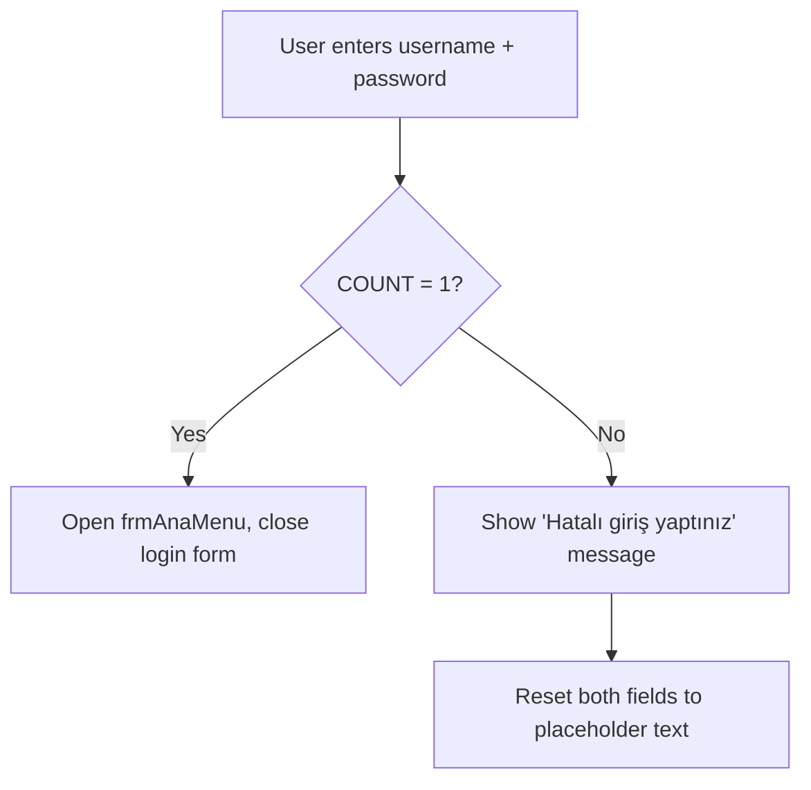
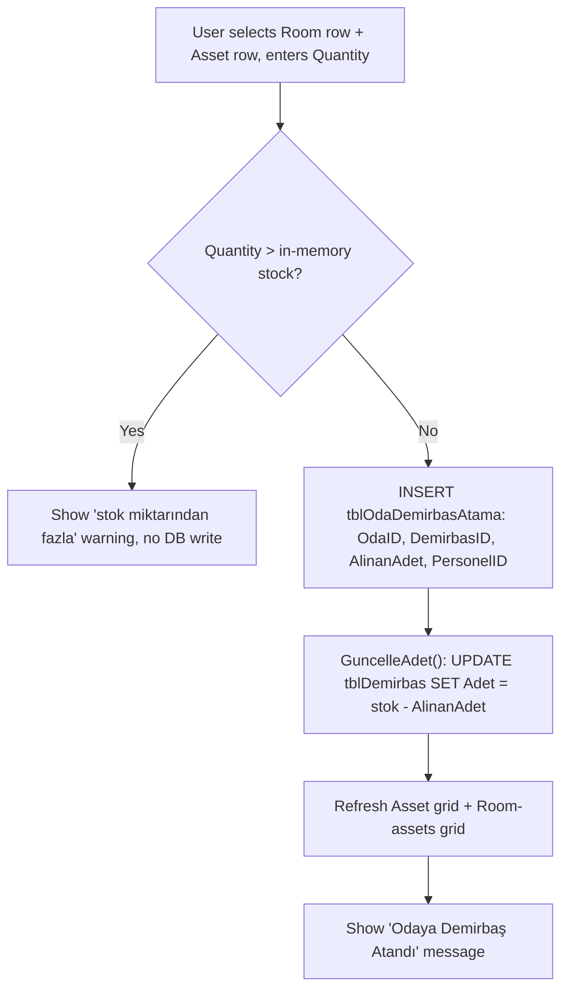
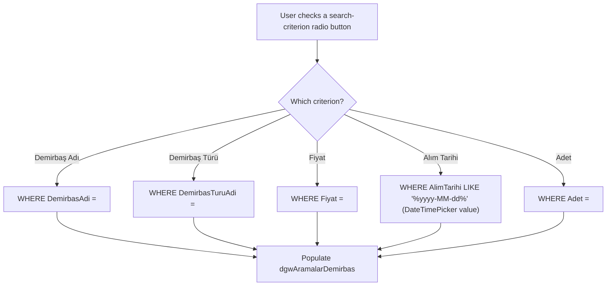

# Functional Spec: Fixed Asset & Inventory Tracking System (YazılımSınamaProjesi / DemirbasTakip)

**Path analyzed:** C:\Users\MohamedRaashidBISTEC\OneDrive - BISTEC Global\Documents\specclaw project\InventoryTrackingSystem\InventoryTrackingSystem
**Date analyzed:** 2026-08-18

**Stack note:** the collector's `forms[]`/`xaml_forms[]`/`other_ui_files[]`/`handler_implementations[]` fields all came back empty (Delphi/.dfm and XAML parsers, not applicable to this C#/WinForms codebase). Every capability, workflow, and UI-inventory line below is grounded directly in the ten `frm*.cs` + `frm*.Designer.cs` file pairs opened this run, plus `Program.cs` and `Test1.cs`/`UnitTest1.cs`.

## Capabilities

### Authentication (`frmGiris.cs` / `GİRİŞ_EKRANI`)
- **Log in with username and password** — fields: Username (`txtUsername`, single-line **TextBox**, pre-filled placeholder text "KULLANICI ADI" cleared on click), Password (`txtPassword`, single-line **TextBox with `PasswordChar='*'`** — masked/password input). On success navigates to Main Menu; on failure shows "Hatalı giriş yaptınız..." and resets both fields to their placeholder text. Two decorative `PictureBox` icons (`pbGirisEkraniUser`, `pbGirisEkraniPass`) accompany the fields but capture no data. Non-empty validation is DR-004 (soft/cosmetic — see domain-model.md).

### Main Menu / Navigation (`frmAnaMenu.cs`)
- **Navigate to a feature area** — five buttons: Search (`btnArama`), Asset Assignment (`btnOdaDemirbasIslemleri`), Room Assignment (`btnOdaTanimlama`), Admin Panel (`btnAdmin`), Reporting (`button1`, labeled "Rapor Çıktısı Al"). Each opens its target form and hides the Main Menu (`this.Hide()`).
- **Admin Panel button is conditionally enabled** — per DR-003, re-evaluated on every Main Menu load.
- Closing the Main Menu exits the entire application (`frmAnaMenu_FormClosing`: `Application.Exit()`).

### Admin Panel (`frmAdmin.cs`)
- **Navigate to an admin-only sub-screen** — five buttons routing to Stock Add (`btnStokEkle`), Stock Update (`btnStokGuncelle`), Room Delete (`btnOdaSil`), Room Add (`btnOdaEkle`), Room Update (`btnOdaGuncelle`). Pure router with no data access of its own (confirmed: no `SqlConnection` field in this file).

### Room Assignment (`frmOdaTanimlama.cs`)
- **Assign a responsible staff member to a room** — cross-references the "Room-to-Personnel Assignment" workflow below. User selects a row in the Room grid (`dGWOda`, read-only **DataGridView**, single-select via `RowEnter`) and a row in the Personnel grid (`dGWPersonel`, read-only **DataGridView**), then clicks Kaydet (`btnOTodaKaydet`). Selected values echo into two disabled/read-only TextBoxes (`txtOTodaAdi`, `txtOTOdaSorumlusu`) — these are display-only, not user-entered fields.
- **Named Gap:** no non-empty/selection guard and no `try/catch` around the insert — see PQ-005.

### Room Add (`frmOdaEkle.cs`)
- **Add a new room** — fields: Room name (`txtOdaESGodaAdi`, plain **TextBox**, no keypress filter), Department (captured via a paired **ListBox** selector — `lboxDepartmanID`/`lboxDepartmanAdi` populated from `tblDepartmanlar`; selecting an ID row echoes into a disabled TextBox `txtDepartmanID`, not free-typed). On success, clears every `TextBox` child control and shows "Oda başarıyla eklendi."; on `SqlException` (e.g. a duplicate) shows "Kayıtlı Oda..." (DR-004 non-empty check on room name only).

### Room Update (`frmOdaGuncelle.cs`)
- **Rename an existing room** — fields: existing-room selector (`cboOdaESGodaAdiGuncel`, a **ComboBox** whose options are sourced from a live `SELECT * FROM tblOda` query, i.e. every current room name), new room name (`txtOdaESGyeniOdaAdi`, plain **TextBox**). ⚠ See PQ-004 — keyed by name, not ID.

### Room Delete (`frmOdaSil.cs`)
- **Delete a room** — field: room selector (`cboOdaESGodaAdiSil`, **ComboBox** sourced from `tblOda`). No confirmation dialog is shown before the delete executes. ⚠ See PQ-004 — keyed by name, not ID.

### Stock / Asset Add (`frmStokEkleme.cs`)
- **Add a new fixed-asset stock record** — fields: Asset name (`txtSEdemirbasAdi`, plain **TextBox**, no keypress filter — see DR-006 Named Gap), Price (`txtSEfiyat`, **TextBox** with digit/comma-only keypress filter — DR-005), Purchase date (`dtpAlimTarihi`, a real **DateTimePicker**), Asset Type (paired **ListBox** selector `lboxDemirbasTuruID`/`lboxDemirbasTuruAdi`, sourced from `tblDemirbasTurleri`), Quantity (`txtSEadet`, **TextBox** with digit/comma-only keypress filter — DR-005). Non-empty checks (DR-004) on name/price/quantity only.

### Stock / Asset Update (`frmStokGuncelleme.cs`)
- **Update an existing fixed-asset stock record** — user selects a row from `DGWStokGuncelleme` (read-only **DataGridView**) to populate: Asset name (`txtSGdemirbasAdi`, **TextBox** with letter-only keypress filter — DR-006), Price (`txtSGfiyat`, **TextBox**, digit-only — DR-005), Purchase date (`DtmSGAlimTarihi`, **DateTimePicker**), Quantity (`txtSGadet`, **TextBox**, digit-only — DR-005), Asset Type (paired **ListBox** selector, same pattern as Stock Add). Non-empty checks (DR-004) on name/price/quantity.

### Asset Assignment (`frmDemirbasIslem.cs`)
- **Issue a fixed asset to a room** — cross-references the "Asset Assignment & Stock Decrement" workflow below (a Composite Flow — see Workflows). User selects a row in the Room grid (`dgwOdalar`, read-only **DataGridView**) and a row in the Asset grid (`dgwDemirbas`, read-only **DataGridView**), enters a Quantity (`txtDIAdet`, **TextBox** with digit-only keypress filter — DR-005), then clicks Kaydet (`btnDemirbasIslemKaydet`). DR-001 blocks the save if quantity exceeds available stock.

### Search (`frmAramalar.cs`)
- **Search fixed assets by one of five criteria** — a mutually-exclusive **RadioButton** group (`rdbDemirbasAdi` default-checked, `rdbDemirbasTuru`, `rdbFiyat`, `rdbAlimTarihi`, `rdbAdet`) selects which `WHERE` clause runs against a shared free-text box (`txtAramalarBilgiGiriniz`, **TextBox**) — except for the "Alım Tarihi" (purchase date) criterion, which swaps in a **DateTimePicker** (`dtmBilgi`) in place of the text box (toggled visibility via `dtmGizle()`/`dtmGoster()`). Results render into `dgwAramalarDemirbas` (read-only **DataGridView**). Non-empty check (DR-004) on the free-text box only (not applicable when the date picker is active).
- **Search personnel by first/last name** — fields: `txtAramalarAd` (letter-only keypress filter — DR-006), `txtAramalarSoyad` (letter-only keypress filter — DR-006), both plain **TextBox**es. Results render into `dgwAramalarPersonel` (read-only **DataGridView**).

### Reporting & Print (`frmRapor.cs`)
- **View a per-room asset-assignment report** — cross-references the "Room Occupancy Report" workflow below. Room selector (`cmbRapor`, **ComboBox** sourced from `tblOda`), a "Listele" button (`btnRaporArama`) to refresh, results in `dgwRapor` (read-only **DataGridView**). Loads with the first room pre-selected (`cmbRapor.SelectedIndex = 0`).
- **Print the current report** — `btnYazdir_Click` renders the grid to a `Bitmap` and opens a Windows `PrintDialog` (`PpdDialog`), handing off to the OS print subsystem (see architecture.md L1). No file/image field is involved — the bitmap is a transient render target, not a stored/captured field.

## Workflows

### Login (branches on credential validity)

`GİRİŞ_EKRANI.button1_Click` reads `txtUsername`/`txtPassword`, runs `SELECT COUNT(*) FROM tblKullanicilar WHERE KullaniciAdi=... AND Sifre=...`, and branches on the result.

On success, `frmAnaMenu`'s own `ANA_MENÜ_Load` immediately re-runs a second query (`SELECT YetkiID FROM tblKullanicilar ...`) against the same static username/password fields to decide whether to enable the Admin button (DR-003) — the authenticated identity is carried between these two forms entirely through `GİRİŞ_EKRANI`'s `public static string kAdi, sifre;` fields, not a typed session object.

### Asset Assignment & Stock Decrement (Composite Flow)

A single click of `btnDemirbasIslemKaydet` in `frmDemirbasIslem.cs` triggers a sequence of two distinct backend writes, after an in-memory guard:

1. **Guard (DR-001):** if `Alinanadet > stok` (requested quantity exceeds the in-memory stock count captured when the asset row was selected), show a warning and stop — no database call happens.
2. **Call 1 — `INSERT INTO tblOdaDemirbasAtama`:** parameters `OdaID` (from the selected room row), `DemirbasID` (from the selected asset row), `AlinanAdet` (the entered quantity), `PersonelID` (inherited from the room's existing room-responsibility row — see domain-model.md's `RoomAssetAssignment` entity and PQ-003/PQ-007).
3. **Call 2 — `GuncelleAdet()` → `UPDATE tblDemirbas SET Adet=@adet WHERE DemirbasID=@demirbasID`:** `@adet` is computed as `(stok - Alinanadet)`, i.e. the asset's on-hand stock is decremented by exactly what was just issued (DR-002).
4. Both grids refresh (`dgwDemirbasDoldur()`, `dgwOdaSecimiDoldur()` — reads only, not additional business writes).

**What is lost if step 3 is omitted:** the asset's `tblDemirbas.Adet` would remain at its pre-assignment count even though units were just issued — every subsequent DR-001 stock-adequacy check would then compare the requested quantity against a stale (too-high) stock figure, allowing the same units to be "issued" repeatedly without ever running out. This sequence is why the capability bullet above ("Issue a fixed asset to a room") cross-references this workflow rather than describing the insert alone.

Each of the four data/query methods involved (`dgwOdaDoldur`, `dgwDemirbasDoldur`, `dgwOdaSecimiDoldur`, `GuncelleAdet`) opens and closes its own `SqlConnection` independently (via the shared `VTbaglan()`/`VTkapat()` pair) rather than sharing one open connection across the sequence — one user click opens/closes the database connection multiple times in immediate succession (confirmed directly in `frmDemirbasIslem.cs`; also noted in architecture.md's L4 section).

### Room-to-Personnel Assignment (linear)

`frmOdaTanimlama.cs`: user selects a Room grid row (populates `Odaid`) and a Personnel grid row (populates `Personelid`), then clicks Kaydet, which runs a single `INSERT INTO tblOdaDemirbasAtama(OdaID,PersonelID)`. Linear — no validation branch exists in code (see PQ-005 Named Gap on the missing guard/try-catch).

### Search (branches on selected criterion)

`frmAramalar.cs`'s asset-search side branches into one of five `WHERE` clauses depending on which `RadioButton` is checked, with the input control itself changing (free-text box vs. date picker) depending on the branch:

The personnel-name search (same form) is a separate, linear, always-on filter over `tblPersonel`/`tblOdaDemirbasAtama`/`tblDemirbas`, independent of the radio-button group above.

### Room Occupancy Report & Print (linear, with a print-side error branch)

`frmRapor.cs`: on load, populates the room selector (`ComboboxDoldur()`), pre-selects the first room, and immediately runs `RaporDoldur()` to populate the grid. Clicking "Listele" re-runs `RaporDoldur()` for the currently selected room. Clicking "Yazdır" renders the grid to a `Bitmap` and opens the Windows print dialog; a `try/catch` around this shows "Hata Oluştu..." on any rendering/print failure, with no further detail. This is a read/render sequence, not a Composite Flow under the domain rule (no additional business-significant write occurs — see domain-model.md), so it is documented here as a plain multi-step workflow rather than under Business Rules.

## UI Inventory

All eleven form entries below were fully parsed by direct `Read` of each `frm*.cs` + `frm*.Designer.cs` pair (the collector's `forms[]`/`xaml_forms[]` arrays came back empty for this stack — see the stack note at the top of this document).

| Form (class) | Purpose | Controls (declared) | Handlers (wired) | Non-text / notable controls |
|---|---|---|---|---|
| `GİRİŞ_EKRANI` (`frmGiris.cs`) | Login | 6: `btnGiris`, `txtUsername`, `txtPassword`, `errorProvider1`, `pbGirisEkraniPass`, `pbGirisEkraniUser` | 7: `button1_Click`, `Form1_Click`, `txtUsername_Validated`, `txtPassword_Validated`, `txtUsername_Click`, `txtPassword_Click`, (form `Click`) | `txtPassword` is a masked (`PasswordChar='*'`) TextBox; 2 `PictureBox` icons |
| `frmAnaMenu` | Main menu / navigation hub | 5 buttons | 6: `ANA_MENÜ_Load`, `btnArama_Click`, `btnOdaDemirbas_Click`, `btnOdaTanimlama_Click`, `btnAdmin_Click`, `frmAnaMenu_FormClosing`, `button1_Click` (7 total) | none (all Button) |
| `frmAdmin` | Admin sub-router | 6 buttons | 6 Click handlers | none (all Button; one has an `Image`/`FlatStyle` back-icon) |
| `frmOdaTanimlama` | Room ⇄ personnel assignment | 8: 2 buttons, 2 labels, 2 TextBoxes (disabled/echo), 2 `DataGridView` | 4: `btnTanimlamaBack_Click`, `frmOdaTanimlama_Load`, `btnOTodaKaydet_Click`, `dGWOda_RowEnter`, `dGWPersonel_RowEnter` (5 total) | 2 read-only `DataGridView` grids |
| `frmOdaEkle` | Room add | 9: label, TextBox, Button, GroupBox, TextBox (disabled), label, 2 `ListBox`, Button, `errorProvider1` | 4: `frmOdaEkle_Load`, `btnOdaESGekle_Click`, `btnOdaEkleSilBack_Click`, `lboxDepartmanID_SelectedIndexChanged` | 2 `ListBox` (Department ID/Name pair) |
| `frmOdaGuncelle` | Room rename | 7: 2 TextBox, 2 label, Button, GroupBox, `ComboBox`, Button | 3: `frmOdaGuncelle_Load`, `btnOdaESGguncelle_Click`, `btnOdaEkleSilBack_Click` | `ComboBox` (room picker, DB-sourced) |
| `frmOdaSil` | Room delete | 5: label, Button, GroupBox, `ComboBox`, Button | 3: `frmOdaSil_Load`, `btnOdaESGsil_Click`, `btnOdaEkleSilBack_Click` | `ComboBox` (room picker, DB-sourced); **no confirmation dialog before delete** |
| `frmStokEkleme` | Stock/asset add | 14: 5 labels, 3 TextBox, `DateTimePicker`, 2 `ListBox`, TextBox (disabled), 2 Buttons, `errorProvider1` | 5: `frmStokEkleme_Load`, `btnStokEklemeBack_Click`, `btnSEekle_Click`, `lboxDemirbasTuruID_SelectedIndexChanged`, `txtSEfiyat_KeyPress`, `txtSEadet_KeyPress` (6 total) | `DateTimePicker` (purchase date); 2 `ListBox` (asset-type ID/Name pair) |
| `frmStokGuncelleme` | Stock/asset update | 15: `DataGridView`, `DateTimePicker`, 4 TextBox, 5 labels, 2 `ListBox`, 2 Buttons, `errorProvider1` | 6: `frmStokGuncelleme_Load`, `btnSGguncelle_Click`, `btnStokGuncellemeBack_Click`, `DGWStokGuncelleme_RowEnter`, `lboxSGDemirbasTuruID_SelectedIndexChanged`, `txtSGdemirbasAdi_KeyPress`, `txtSGfiyat_KeyPress`, `txtSGadet_KeyPress` (8 total) | read-only `DataGridView`; `DateTimePicker`; 2 `ListBox` |
| `frmDemirbasIslem` | Asset-to-room assignment | 13: 3 labels, `DataGridView` (x3), Button, TextBox, Button, 2 GroupBox, 2 TextBox (disabled), `errorProvider1` | 6: `frmDemirbasIslem_Load`, `btnDemirbasIslemKaydet_Click`, `btnDemirbasBack_Click`, `dgwOdalar_RowEnter`, `dgwDemirbas_RowEnter`, `txtDIAdet_KeyPress` | 3 `DataGridView` grids (2 read-only selection grids + 1 read-only result list) |
| `frmAramalar` | Search (assets + personnel) | 18+: 2 GroupBox, 2 `DataGridView`, 5 `RadioButton`, `DateTimePicker`, 4 TextBox, 3 labels, 2 Buttons, `errorProvider1` | 11: `frmAramalar_Load`, `btnAramalarArama_Click`, `btnAramalarBack_Click`, `btnDemirbasArama_Click`, 5×`rdbXxx_CheckedChanged`, `txtAramalarAd_KeyPress`, `txtAramalarSoyad_KeyPress` | 5 `RadioButton` (mutually exclusive search-criterion selector); `DateTimePicker` (conditionally visible); 2 read-only `DataGridView` |
| `frmRapor` | Room occupancy report + print | 8: Button, `DataGridView`, Button, `ComboBox`, label, Button, `PrintDialog`, `PrintDocument` | 5: `frmRapor_Load`, `btnRaporArama_Click`, `btnAramalarBack_Click`, `PDYazici_PrintPage`, `btnYazdir_Click` | `ComboBox` (room picker); read-only `DataGridView`; **`PrintDialog`/`PrintDocument`** (OS print integration, not a data-capture control) |

Two non-form files complete the UI-adjacent inventory:
- **`Program.cs`** — application bootstrap only (`Application.Run()` around `GİRİŞ_EKRANI`); not a screen.
- **`Test1.cs`** — not a screen; a standalone validation-helper class with no UI, dead/unwired from every form above (see domain-model.md DR-007 and Named Gaps below).

One further UI-adjacent resource is detection-only and not deep-parsed: **`frmAdminsilinecek.resx`** (listed in `top_level_dirs`) has no corresponding `.cs`/`.Designer.cs` file anywhere in scope — an orphaned resource file whose original form (if any) is not recoverable from what's in scope.

## Named Gaps

1. **No user-management screen.** Nothing in scope creates, edits, lists, or deletes `tblKullanicilar` rows (login accounts, including the `YetkiID` authorization flag) — accounts must be provisioned directly against the database outside this application.
2. **No CRUD screens for three lookup entities.** `Department` (`tblDepartmanlar`), `Personnel` (`tblPersonel`), and `AssetType` (`tblDemirbasTurleri`) are read everywhere but written nowhere in the ten forms opened — all three are populated/maintained outside this application.
3. **`tblOdaDemirbasAtama` dual-purpose row shape** — could not confirm from app code alone whether this table has one nullable-column row shape or two logically distinct row kinds (room-responsibility vs. asset-issue); no DDL/schema file was in scope to check. See PQ-003.
4. **Room rename/delete keyed by name, not ID** — `frmOdaGuncelle.cs`/`frmOdaSil.cs` both match `WHERE OdaAdi=@odaAdi`, the sole exception to this codebase's otherwise ID-keyed CRUD pattern. See PQ-004.
5. **Room Assignment screen has no validation or error handling** — `frmOdaTanimlama.cs`'s `btnOTodaKaydet_Click` has no `try/catch` and no non-empty/selection guard before its insert, unlike every other mutating form in scope. See PQ-005.
6. **`frmStokEkleme.cs`'s `HarfGirisiKontrol` method is declared but never wired** to any control — the Stock Add screen's asset-name field accepts unrestricted free text, unlike the Stock Update screen's equivalent field (DR-006).
7. **`Test1.FiyatDogruMu` is dead/unwired code** — declared and unit-tested (`UnitTestProject1/UnitTest1.cs`) but never called from any of the ten production forms opened; its single-space (`" "`) special case (returning `0` rather than treating the input as invalid) has no stated rationale anywhere in scope (DR-007).
8. **No confirmation dialog before room deletion** (`frmOdaSil.cs`) — the delete executes immediately on button click with no "are you sure" step.
9. **Generic duplicate-record error messages** ("Kayıtlı Oda...", "Kayıtlı Demirbaş...") in `frmOdaEkle.cs`/`frmStokEkleme.cs` imply a database-level uniqueness constraint that is caught only via a bare `catch` — the exact column(s) constrained could not be confirmed since no schema/DDL file was in scope.
10. **Orphaned resource file** — `frmAdminsilinecek.resx` (in `top_level_dirs`) has no corresponding `.cs`/`.Designer.cs` pair anywhere in scope; its original purpose is not recoverable from what's in scope.
11. **Unanalyzed database-project remnants** — `Deneme.smproj`/`deneme.smproj`/`Deneme.smp.old` appear at both the repository root and inside `YazılımSınamaProjesi/`; these are not `.cs`/manifest files and were not deep-parsed. If one of these is an actual SQL Server Database Project, it could hold the authoritative schema this analysis lacked — worth a follow-up look outside this run's scope.
12. **Possible duplicate rows in the Asset Assignment room grid** — `frmDemirbasIslem.cs`'s `dgwOdaDoldur()` query joins `tblOda`/`tblOdaDemirbasAtama`/`tblPersonel` with no filter distinguishing room-responsibility rows from asset-issue rows (see Named Gap 3 / PQ-003); if both row kinds coexist for the same room, this grid may display duplicate room/personnel entries. Could not confirm without the underlying schema.
13. **Module ownership contested for two entities** — `Personnel` (PQ-006) and `RoomAssetAssignment` (PQ-007) are each written/read by two modules with comparable centrality; see module-map.md.
