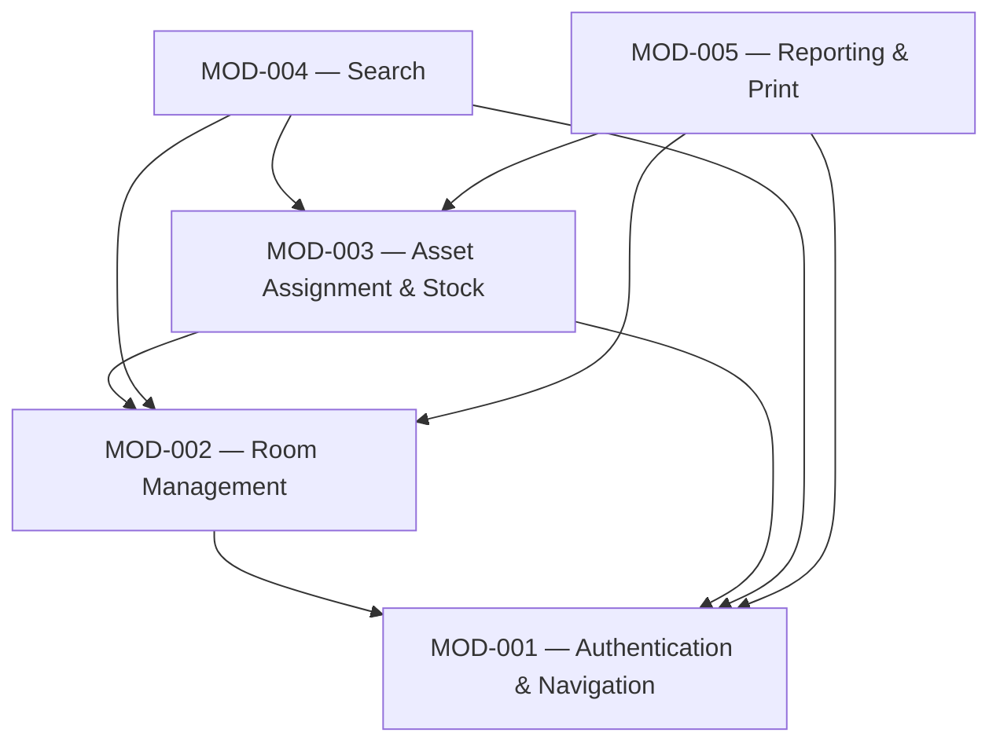

# Module Map: Fixed Asset & Inventory Tracking System (YazılımSınamaProjesi / DemirbasTakip)

**Path analyzed:** C:\Users\MohamedRaashidBISTEC\OneDrive - BISTEC Global\Documents\specclaw project\InventoryTrackingSystem\InventoryTrackingSystem
**Date analyzed:** 2026-08-18
**Status:** CONFIRMED by Hafsa, 28-8-2026

No prior `module-map.md` existed for this repository (`module_map.present: false`, `next_mod_id: "MOD-001"`, `prior_modules: []` in the collected facts) — every module below is newly minted, starting at MOD-001. Grouping follows the ten components architecture.md already established at L3 (`Bootstrap`, `Auth`, `Main Menu/Navigation`, `Admin Panel`, `Room Assignment`, `Room CRUD`, `Stock Management`, `Asset Assignment`, `Search`, `Reporting/Print`), consolidated into five migration/acceptance units along entity and business-rule boundaries rather than by directory layout (this codebase has no directories at all beyond the one project folder, so directory-name grouping was never a risk here).

## Modules

### MOD-001 — Authentication & Navigation

- **Purpose:** authenticate a user, carry the authenticated identity forward via static fields, gate the admin entry point, and provide the app's central navigation hub and admin sub-router. Corresponds to architecture.md's L3 `Bootstrap`, `Auth`, `Main Menu / Navigation`, and `Admin Panel` components.
- **Owns (entities):** User
- **References (not owned):** None
- **Services/routes:** none (no service layer anywhere in this codebase; each form owns its own ADO.NET access)
- **Screens:** Login (`GİRİŞ_EKRANI` / `frmGiris.cs`), Main Menu (`frmAnaMenu.cs`), Admin Panel (`frmAdmin.cs`), Bootstrap (`Program.cs`)
- **Business rules:** DR-003
- **Depends on:** None
- **Backlog items:** not yet backlog-linked — rebuild-backlog.md does not exist yet
- **Evidence:**
  - `frmGiris.cs`: `VTbaglan()`/login query (`"SELECT COUNT(*) FROM tblKullanicilar WHERE KullaniciAdi=... AND Sifre=..."`), `public static string kAdi, sifre;`
  - `frmAnaMenu.cs`: `ANA_MENÜ_Load` (`"SELECT YetkiID FROM tblKullanicilar ..."`, `btnAdmin.Enabled` gate — DR-003), five navigation `Click` handlers, `frmAnaMenu_FormClosing` (`Application.Exit()`)
  - `frmAdmin.cs`: six `Click` handlers routing to Room/Stock sub-screens, no `SqlConnection` field
  - `Program.cs`: `Main()` bootstrap (`GİRİŞ_EKRANI giris = new GİRİŞ_EKRANI(); giris.Show();`)
  - architecture.md L3: "Bootstrap ... constructs and shows the login form", "Auth ... runs the login query and, on success, opens Main Menu", "Main Menu / Navigation ... is the app's navigation hub", "Admin Panel ... is a pure routing screen"

### MOD-002 — Room Management

- **Purpose:** define/maintain rooms and assign a responsible staff member to each room. Corresponds to architecture.md's L3 `Room Assignment` and `Room CRUD (Admin)` components.
- **Owns (entities):** Room, Department
- **References (not owned):** Personnel ⚠ PROVISIONAL — pending PQ-006 (proposed default: owned by MOD-002, so this is a self-reference pending confirmation — see PQ-006 for the full contest); RoomAssetAssignment ⚠ PROVISIONAL — pending PQ-007 (proposed default: owned by MOD-003) — this module writes room-responsibility rows into it but does not currently hold provisional ownership
- **Services/routes:** none (direct ADO.NET per form)
- **Screens:** Room Assignment (`frmOdaTanimlama.cs`), Room Add (`frmOdaEkle.cs`), Room Update (`frmOdaGuncelle.cs`), Room Delete (`frmOdaSil.cs`)
- **Business rules:** None owned outright (DR-004 is cross-cutting — see Unassigned)
- **Depends on:** MOD-001 (reachable only via Main Menu → Room Assignment, and Admin Panel → Room Add/Update/Delete — architecture.md L3: `mainMenu --> roomAssign`, `adminPanel --> roomCrud`)
- **Backlog items:** not yet backlog-linked — rebuild-backlog.md does not exist yet
- **Evidence:**
  - `frmOdaTanimlama.cs`: `"insert into tblOdaDemirbasAtama(OdaID,PersonelID)values(...)"` (room-responsibility write)
  - `frmOdaEkle.cs`: `"insert into tblOda(OdaAdi,DepartmanID) values (...)"`, `"SELECT *FROM tblDepartmanlar"` (Department lookup)
  - `frmOdaGuncelle.cs`: `"UPDATE tblOda SET OdaAdi=@odaAdi WHERE OdaAdi=@EodaAdi "`
  - `frmOdaSil.cs`: `"DELETE FROM tblOda WHERE OdaAdi=@odaAdi "`
  - architecture.md L3: "Room Assignment ... assigns a PersonelID to an OdaID", "Room CRUD (Admin) ... grouped as one component because all three are reachable only from Admin Panel ... and all target tblOda"

### MOD-003 — Asset Assignment & Stock

- **Purpose:** maintain the fixed-asset stock catalog and issue assets from stock into rooms, decrementing on-hand stock as it is issued. Corresponds to architecture.md's L3 `Stock Management (Admin)` and `Asset Assignment` components (the latter also singled out for its own L4 diagram there).
- **Owns (entities):** FixedAsset, AssetType, RoomAssetAssignment ⚠ PROVISIONAL — pending PQ-007 (proposed default: owned by MOD-003, per the reasoning in that question — the table's own name and both business rules that touch it live here)
- **References (not owned):** Room (MOD-002); Personnel ⚠ PROVISIONAL — pending PQ-006 (proposed default: owned by MOD-002)
- **Services/routes:** none (direct ADO.NET per form)
- **Screens:** Stock Add (`frmStokEkleme.cs`), Stock Update (`frmStokGuncelleme.cs`), Asset Assignment (`frmDemirbasIslem.cs`)
- **Business rules:** DR-001, DR-002
- **Depends on:** MOD-001 (navigation), MOD-002 (references the Room entity it does not own)
- **Backlog items:** not yet backlog-linked — rebuild-backlog.md does not exist yet
- **Evidence:**
  - `frmStokEkleme.cs`: `"insert into tblDemirbas(...)"`, `"SELECT *FROM tblDemirbasTurleri"` (AssetType lookup)
  - `frmStokGuncelleme.cs`: `"UPDATE tblDemirbas SET ... WHERE DemirbasID=@demirbasID "`
  - `frmDemirbasIslem.cs`: `btnDemirbasIslemKaydet_Click` (DR-001 guard, `"insert into tblOdaDemirbasAtama(OdaID,DemirbasID,AlinanAdet,PersonelID)..."`), `GuncelleAdet()` (DR-002, `"UPDATE tblDemirbas SET Adet=@adet ..."`), `dgwOdaDoldur()` (reads `tblOda`/`tblPersonel` — reference, not ownership)
  - architecture.md L3/L4: "Stock Management (Admin) ... both insert/update tblDemirbas", "Asset Assignment ... is the most stateful component in the container", L4's full trace of `btnDemirbasIslemKaydet_Click`'s insert-then-`GuncelleAdet()` sequence

### MOD-004 — Search

- **Purpose:** ad-hoc lookup screens over fixed assets (five filter criteria) and personnel-linked asset assignments. Corresponds to architecture.md's L3 `Search` component.
- **Owns (entities):** None
- **References (not owned):** FixedAsset (MOD-003), AssetType (MOD-003), Personnel ⚠ PROVISIONAL — pending PQ-006 (proposed default: MOD-002), RoomAssetAssignment ⚠ PROVISIONAL — pending PQ-007 (proposed default: MOD-003)
- **Services/routes:** none (direct ADO.NET)
- **Screens:** Search (`frmAramalar.cs`)
- **Business rules:** None owned (DR-006 is cross-cutting — see Unassigned)
- **Depends on:** MOD-001 (navigation), MOD-002 (references Personnel), MOD-003 (references FixedAsset/AssetType/RoomAssetAssignment)
- **Backlog items:** not yet backlog-linked — rebuild-backlog.md does not exist yet
- **Evidence:**
  - `frmAramalar.cs`: `dgwDemirbasAramalarDoldur()`/`btnDemirbasArama_Click` (five `tblDemirbas`/`tblDemirbasTurleri` filter queries), `dgwPersonelAramaDoldur()`/`btnAramalarArama_Click` (`tblPersonel`/`tblOdaDemirbasAtama`/`tblDemirbas` join)
  - architecture.md L3: "Search ... offers five mutually-exclusive filtered searches over tblDemirbas/tblDemirbasTurleri ... plus a personnel-name search over tblPersonel/tblOdaDemirbasAtama"

### MOD-005 — Reporting & Print

- **Purpose:** display a per-room asset-assignment report and print it via the OS print subsystem. Corresponds to architecture.md's L3 `Reporting / Print` component.
- **Owns (entities):** None
- **References (not owned):** Room (MOD-002), Personnel ⚠ PROVISIONAL — pending PQ-006 (proposed default: MOD-002), FixedAsset (MOD-003), RoomAssetAssignment ⚠ PROVISIONAL — pending PQ-007 (proposed default: MOD-003)
- **Services/routes:** none (direct ADO.NET); one external-system integration (Windows `PrintDialog`/`PrintDocument` — OS print subsystem, per architecture.md L1)
- **Screens:** Reporting (`frmRapor.cs`)
- **Business rules:** None owned
- **Depends on:** MOD-001 (navigation), MOD-002 (references Room/Personnel), MOD-003 (references FixedAsset/RoomAssetAssignment)
- **Backlog items:** not yet backlog-linked — rebuild-backlog.md does not exist yet
- **Evidence:**
  - `frmRapor.cs`: `ComboboxDoldur()` (`tblOda`), `RaporDoldur()` (`tblOda`/`tblOdaDemirbasAtama`/`tblPersonel`/`tblDemirbas` join), `btnYazdir_Click`/`PDYazici_PrintPage` (bitmap render + `PrintDialog`)
  - architecture.md L1: "a printer / the OS print subsystem — is used by the reporting screen ... the app performs client-side print rendering, handed off to Windows' print subsystem"

## Cross-Module References

| Entity | Owning module | Referencing modules |
|---|---|---|
| Personnel | MOD-002 ⚠ PROVISIONAL (PQ-006) | MOD-003, MOD-004, MOD-005 |
| Room | MOD-002 | MOD-003, MOD-005 |
| FixedAsset | MOD-003 | MOD-004, MOD-005 |
| AssetType | MOD-003 | MOD-004 |
| RoomAssetAssignment | MOD-003 ⚠ PROVISIONAL (PQ-007) | MOD-002 (writes to it — see PQ-007), MOD-004, MOD-005 |

`RoomAssetAssignment`'s row in this table is the one genuine dual-write case: MOD-002's `frmOdaTanimlama.cs` performs its own `INSERT` into this table (room-responsibility rows) rather than merely reading it, which is exactly why PQ-007 exists — a plain "referencing module" reader would not warrant a pending question on its own, but a second writer does.

## Module Dependencies

Direction is derived two ways: (1) from architecture.md's own L3 flowchart, which is present in this repository (`architecture_md.present: true`) and states the navigation edges `mainMenu --> search`, `mainMenu --> assetAssign`, `mainMenu --> roomAssign`, `mainMenu --> adminPanel`, `mainMenu --> reporting`, `adminPanel --> stockMgmt`, `adminPanel --> roomCrud` — every module reachable only through Main Menu/Admin Panel navigation depends on MOD-001; and (2) from the entity references traced directly in this run (MOD-003/MOD-004/MOD-005 each read entities MOD-002 or MOD-003 own, per the Cross-Module References table above), which is why MOD-003 also depends on MOD-002, and MOD-004/MOD-005 depend on both MOD-002 and MOD-003. No dependency edge here is asserted without one of these two citations.

## Unassigned

- **DR-004 (required-field soft validation)** — cross-cutting UI pattern spanning MOD-001 (login), MOD-002 (room add), MOD-003 (stock add/update, asset assignment), and MOD-004 (search) screens; no single module is its owner.
- **DR-005 (numeric-only keypress filters)** — cross-cutting UI pattern spanning MOD-003 (asset assignment, stock add/update) screens only, but implemented as a repeated per-form pattern rather than a shared owned component; left unassigned rather than force-owned by one screen's module.
- **DR-006 (letter-only keypress filters)** — cross-cutting UI pattern spanning MOD-003 (stock update) and MOD-004 (search) screens.
- **DR-007 (`Test1.FiyatDogruMu` price-string classifier)** — dead/unwired code; no screen in any module invokes it (see functional-spec.md Named Gap 7).
- **`Test1.cs` ("Validation Helper" in architecture.md's L3)** — dead/unwired code, no business-flow module exercises it; its only caller is the separate Test Harness container.
- **`UnitTestProject1` container** — test infrastructure (MSTest harness for `Test1.cs`), not a business-flow migration unit.
- **`frmAdminsilinecek.resx`** — orphaned resource file with no corresponding form anywhere in scope (see functional-spec.md Named Gap 10); cannot be assigned to a module without knowing what screen it belonged to.
- **`Deneme.smproj`/`deneme.smproj`/`Deneme.smp.old`** — unanalyzed database-project remnants (see functional-spec.md Named Gap 11); out of scope for this run, not assignable to a module.

## Coverage Check

**Entities (7 total):** User → MOD-001. Room, Department → MOD-002. FixedAsset, AssetType → MOD-003. Personnel → MOD-002 ⚠ PROVISIONAL (PQ-006). RoomAssetAssignment → MOD-003 ⚠ PROVISIONAL (PQ-007). All 7 accounted for; 2 provisional.

**Business rules (7 total, DR-001…DR-007):** DR-001, DR-002 → MOD-003. DR-003 → MOD-001. DR-004, DR-005, DR-006, DR-007 → Unassigned (cross-cutting or dead code, each with a stated reason). All 7 accounted for.

**Screens (11 forms total):** `frmGiris`, `frmAnaMenu`, `frmAdmin` → MOD-001. `frmOdaTanimlama`, `frmOdaEkle`, `frmOdaGuncelle`, `frmOdaSil` → MOD-002. `frmStokEkleme`, `frmStokGuncelleme`, `frmDemirbasIslem` → MOD-003. `frmAramalar` → MOD-004. `frmRapor` → MOD-005. All 11 accounted for.

No entity, business rule, or screen from domain-model.md/functional-spec.md is missing from either a module or the Unassigned list above.
