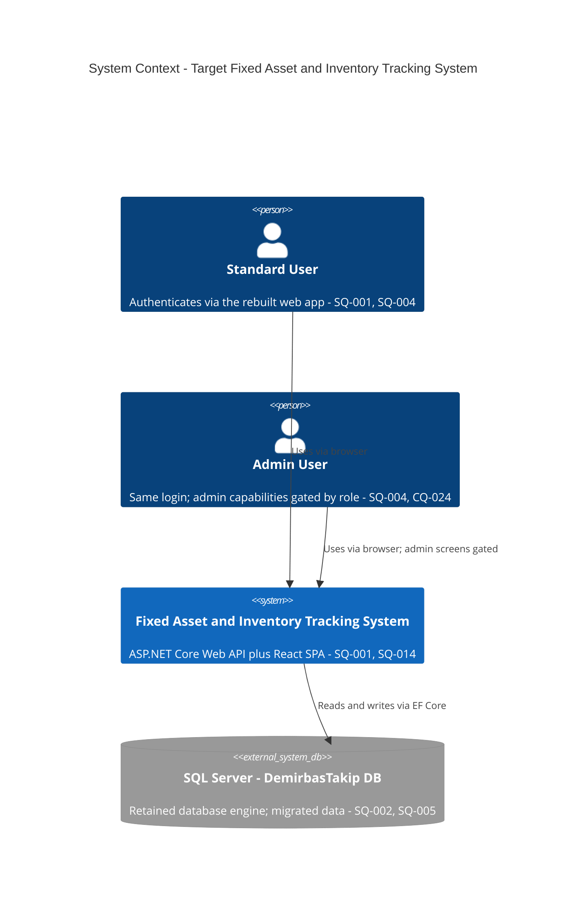
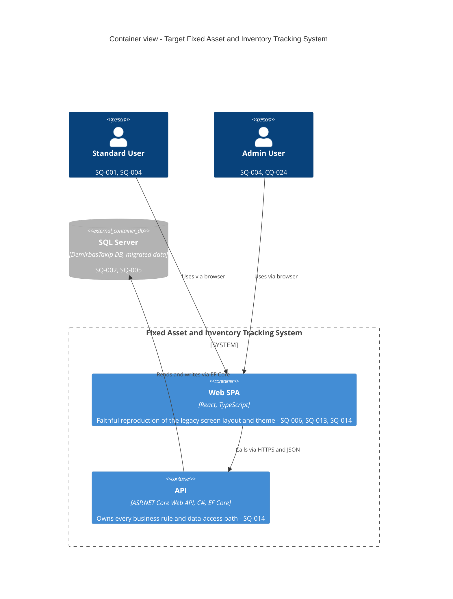
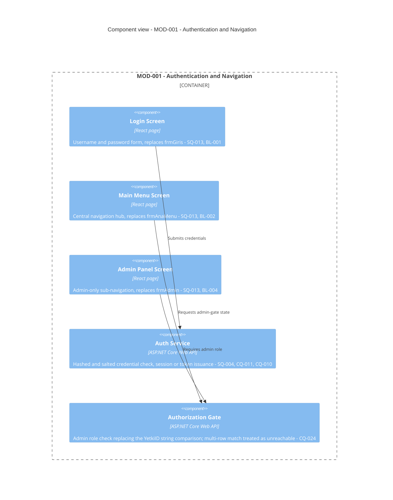
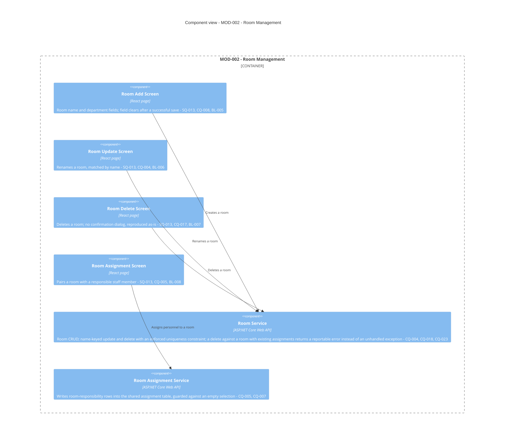
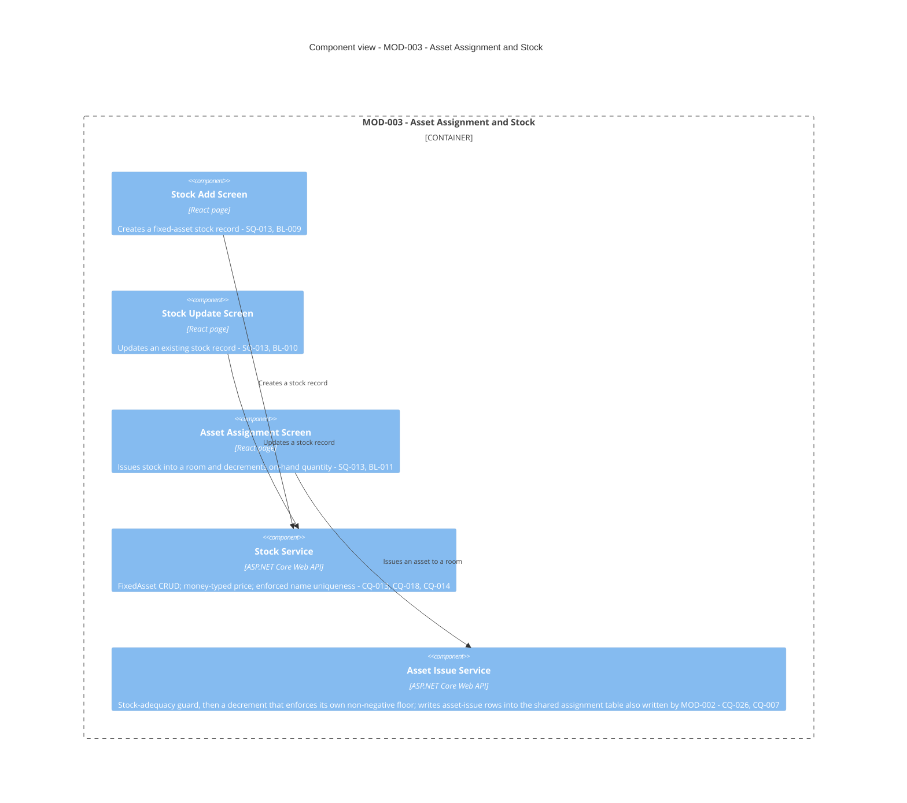
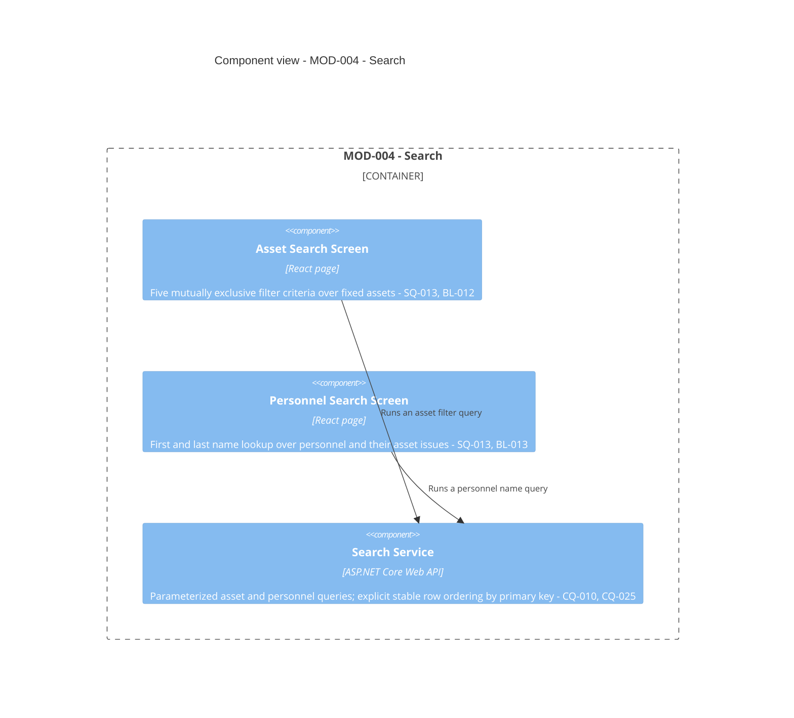
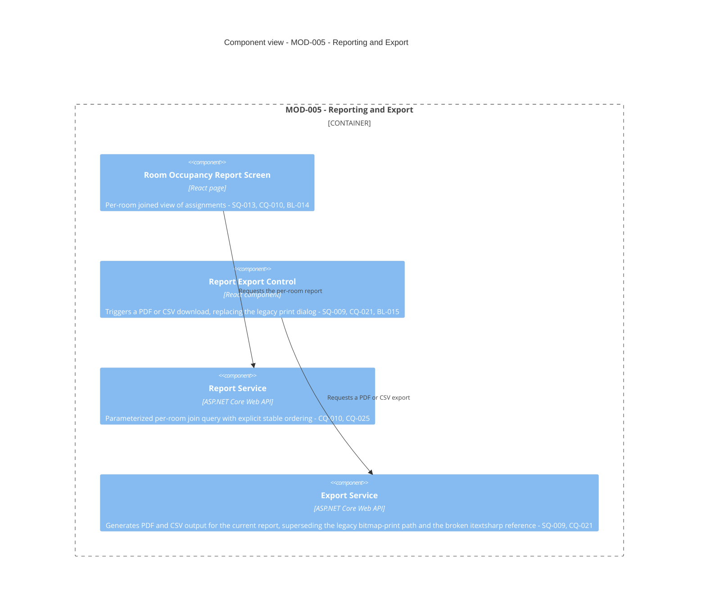

# Target Architecture: InventoryTrackingSystem

**Path analyzed:** /c/Users/MohamedRaashidBISTEC/OneDrive - BISTEC Global/Documents/specclaw project/InventoryTrackingSystem/InventoryTrackingSystem
**Date generated:** 2026-08-28
**Plugin version:** 0.14.3

**Blueprint status:** COMPLETE
**Module map:** CONFIRMED by Hafsa, 28-8-2026
**Source documents consumed:** architecture.md, module-map.md, decisions.md, clarifications.md, domain-model.md, pending-questions.md, rebuild-backlog.md
**Modules:** 5 active

<!--
  NOTE ON THIS COMMENT: never write a literal double-brace placeholder token
  inside this comment's own prose (not even to describe it) — the render
  step's template substitution is a first-occurrence string replace, and a
  token named here would be consumed by this comment instead of the real
  placeholder below. Refer to placeholders by section name instead.

  WHAT THIS DOCUMENT IS. The legacy side of a brownfield rebuild is richly
  documented — architecture.md, domain-model.md, module-map.md. The target
  side used to be scattered across decisions.md, ADRs, bootstrap-plan.md and
  the backlog, with nothing that showed the shape of the thing being built.
  This is that document: the target architecture, synthesised from decisions
  already made, in the same C4 vocabulary the legacy view uses so the two can
  be read side by side.

  IT IS DERIVED, NEVER DECIDED HERE. Every claim about the target rests on a
  recorded decision and cites it by id. Nothing in this file decides
  anything: a target element that no SQ/CQ/UQ sanctions is a gate violation
  and the render step refuses it, and a claim resting on a still-open
  question renders PROVISIONAL(<id>) rather than becoming a confident box in
  a diagram. Changing what this document says means answering a question in
  clarifications.md and re-running --resolve, never editing here.

  THE STATUS BLOCK above is bash-computed, never agent-drafted: the
  COMPLETE/PROVISIONAL verdict and the ids behind it, the warnings, and the
  inputs consumed. Recomputed from scratch every run.

  FULLY REGENERATED EVERY RUN. There is no hand-preserved zone anywhere in
  this file — unlike rebuild-backlog.md's human-added status notes. A
  re-run archives the prior version into .specclaw/analysis/archive/ and
  writes a new one wholesale, exactly like architecture.md and decisions.md.

  WRITTEN IN THE LEGACY REPO. This document is produced by
  /specclaw:bf-blueprint alongside every other analysis output and is never
  created or edited in the rebuild repo. It travels into the new repo as
  readability, never as something a verdict is computed from.

  ── Diagrams ─────────────────────────────────────────────────────────────

  Mermaid's native C4 diagram types: C4Context for the system context,
  C4Container for the container view, C4Component for one view per module.
  One Context diagram, one Container diagram, and one Component diagram per
  MOD-###, grouped under "## MOD-###" headings that mirror rebuild-backlog.md's
  own module grouping so the two documents line up module for module.

  A module whose target shape is entirely undecided gets a SINGLE
  PROVISIONAL placeholder box naming the question that blocks it — never an
  invented design. A speculative component diagram is worse than an empty
  one: it reads as a plan.

  ── The legacy-to-target mapping table ──────────────────────────────────

  One row per legacy container/component from architecture.md. Four columns:

    | Legacy element | Target element | Sanctioning decision | Status |

  Status is one of:
    DECIDED               — the target element rests on a recorded decision
    PROVISIONAL(<id>)     — it rests on a question still open
    RETIRED-BY-DECISION   — a decision explicitly drops this legacy element,
                            and the cited id is that decision

  EVERY ROW CITES SOMETHING. A target element with no sanctioning citation
  and no PROVISIONAL/RETIRED marker is a gate violation, and the render step
  fails the run naming the row. That check is the whole point of the table:
  it is the one place where "what we are building" is forced to line up,
  element by element, with "what somebody actually decided".
-->

## Target Overview

The rebuilt Fixed Asset & Inventory Tracking System is a web application (SQ-001), replacing the legacy single-user WinForms desktop executable (`YazılımSınamaProjesi.exe`, architecture.md § System Context (L1)) with a React + TypeScript single-page application talking to an ASP.NET Core Web API backed by Entity Framework Core against SQL Server (SQ-014). The database engine itself is retained rather than replaced (SQ-002), and every row of existing production data — 6 rooms, 5 assets, 9 users, 9 personnel, 18 departments, 4 asset types, confirmed by direct schema inspection (SQ-010) — migrates into it (SQ-005). The system remains self-hosted, on-prem, and single-tenant (SQ-003), for the same single institution the legacy system already served (CQ-022), and it remains single-user in its concurrency model despite the shift to a web platform (SQ-007) — a deliberate choice that leaves the stock-adequacy check's known race condition (DR-001/DR-002 in domain-model.md) undesigned-for, exactly as it is today.

The rebuild's five migration/acceptance units carry over unchanged from module-map.md's own confirmed grouping: MOD-001 (Authentication & Navigation), MOD-002 (Room Management), MOD-003 (Asset Assignment & Stock), MOD-004 (Search), and MOD-005 (Reporting & Print). Two entities that the legacy code writes from more than one screen keep that dual-write shape rather than being forced under one module: Personnel (`tblPersonel`) is read by MOD-002 and MOD-003 alike as shared, externally-provisioned reference data (CQ-006), and RoomAssetAssignment (`tblOdaDemirbasAtama`) continues to be written by both MOD-002's room-responsibility inserts and MOD-003's asset-issue inserts (CQ-007) — both decisions explicitly follow the legacy structure rather than imposing the module-map's usual single-owner rule.

Authentication and authorization are rebuilt, not ported: SQ-004 replaces the legacy plaintext credential comparison and the string-literal `YetkiID` admin flag with hashed/salted credentials and proper session or token handling. CQ-010 requires parameterizing every SQL query path that currently concatenates user input — the Auth query, the Main Menu's own authorization re-check, Search's ad-hoc filters, and Reporting's per-room filter all inherit this fix directly. CQ-011 requires hashing and salting the 9 existing accounts' passwords as part of migration, since their legacy plaintext values cannot feed a hash comparison directly. What does not change: CQ-012 keeps the legacy assumption that User, Department, Personnel, and AssetType have no admin CRUD screens in this application — they continue to be provisioned via direct database access outside the rebuilt app — and CQ-024 treats the legacy `YetkiID` multi-row-match ambiguity as unreachable in practice, so the rebuild's own authorization check needs no tie-break rule for it.

SQ-012's faithful-by-default policy governs every legacy behavior not individually revisited, and SQ-013 extends that to the UI itself: FAITHFUL fidelity, reproducing the legacy layout structure and color theme within the target web platform's own rendering norms. Under that policy, some legacy defects are deliberately fixed rather than reproduced — Room Add's non-functional field-clear-after-save (CQ-008), Room Assignment's missing empty-selection guard (CQ-005), the missing uniqueness constraints on Room and FixedAsset name fields (CQ-018, applied via CQ-004 for Room), Room Delete's unhandled FK-constraint crash when a room still has assignments — now a real, reportable error condition instead (CQ-023) — and the stock decrement's missing non-negative floor (CQ-026) — while others are deliberately preserved as-is: no confirmation dialog before Room Delete (CQ-017), comma-only decimal-separator keypress filtering (CQ-014), and Stock Add's unwired letter-only filter on the asset-name field (CQ-015). The dead `FiyatDogruMu` price-string classifier (`Test1.cs`) is dropped outright rather than ported (CQ-016) — the legacy Test Harness container itself has no target-side equivalent scoped in this phase, since SQ-011 defers operational and testing tooling to a later phase.

Reporting's legacy bitmap-render-to-OS-print-dialog mechanism has no one-to-one target equivalent and is not ported: CQ-021, settled by SQ-009, replaces it with genuine PDF/CSV export, retiring both the legacy print path and the already-broken `itextsharp` reference at the same time.

Two clarify questions remain genuinely open but do not block this blueprint, per the collected facts' own verdict: CQ-027 asks whether the legacy pattern of two independent, non-agreeing required-field checks (a cosmetic `ErrorProvider` display and a separate `Text.Trim() != ""` gate — DR-004) should be consolidated into one validator or preserved as two, and touches every screen that carries DR-004 across MOD-001, MOD-002, MOD-003, and MOD-004. CQ-028 asks whether Asset Assignment's two-write composite flow (insert the assignment row, then decrement stock — DR-001/DR-002, in MOD-003) must be wrapped in a single database transaction or may reproduce the legacy non-atomic two-connection sequence as-is. Neither changes the shape of any box in the diagrams below, so neither is marked PROVISIONAL here — but both remain open implementation decisions that should be resolved before the affected validators and the composite write are built.

## Target Stack, Persistence, Hosting and Auth

<!--
  Four short subsections, every claim carrying the id of the decision that
  sanctions it, or rendering PROVISIONAL(<id>) when the question is open.
  These are the four things every downstream reader — /specclaw:bf-bootstrap
  most of all — needs stated in one place.
-->

### Stack

Backend: ASP.NET Core Web API (C#) with Entity Framework Core (SQ-014). Frontend: a React + TypeScript single-page application (SQ-014, reaffirmed as the UI framework choice by SQ-006, itself settled by SQ-014). Target platform: web application (SQ-001), reached through modern evergreen browsers only, no legacy-browser support, WCAG AA baseline (SQ-008).

### Persistence

Database engine: SQL Server, kept as-is rather than replaced (SQ-002). All existing production data migrates into it (SQ-005) — the checked-in `DemirbasTakip.mdf`/`_log.ldf` pair is treated as that real data, not a disposable dev artifact (CQ-001). The rebuild's schema adds integrity the legacy schema never had: a real uniqueness constraint on `Room.OdaAdi` and on `FixedAsset.DemirbasAdi` (CQ-018), a `decimal(19,4)` column for `FixedAsset.Fiyat` matching the schema-confirmed `money(19,4)` type (CQ-013), and a non-negative floor enforced by the stock-decrement logic itself rather than by any database constraint, since none exists today (CQ-026).

### Hosting

Self-hosted, on-prem, single-tenant — runs locally, no cloud hosting (SQ-003), for the same single institution the legacy system already served (CQ-022, confirmed jointly by SQ-003 and SQ-007). Concurrency remains scoped to a single user at a time, matching legacy behavior exactly despite the web-platform shift (SQ-007) — the known race-condition risk in the stock-adequacy check (DR-001/DR-002) is deliberately left undesigned-for as a consequence. No special performance work is scoped, given the confirmed small scale (SQ-010: 6 rooms, 5 assets, 9 users, 9 personnel, 18 departments, 4 asset types). Operational tooling — backups, logging, monitoring, CI/CD — is explicitly deferred to a later phase (SQ-011); this document does not assert a backup or monitoring topology as a result.

### Auth

Real authentication and authorization, sized to the target platform: hashed and salted credentials with proper session or token handling (SQ-004), replacing the legacy plaintext comparison and the `YetkiID` string-literal admin flag. CQ-010 requires every SQL query path parameterized — Auth's login query, Main Menu's own authorization re-check, Search's ad-hoc filters, and Reporting's per-room filter all inherit this fix. CQ-011 requires hashing and salting the 9 existing accounts' passwords as part of migration. CQ-012 keeps the legacy assumption that User, Department, Personnel, and AssetType have no admin CRUD screens in this application; they continue to be provisioned via direct database access outside the rebuilt app. CQ-024 treats the legacy multi-row `YetkiID`-match ambiguity as unreachable in practice, so the rebuilt authorization check needs no tie-break rule for it.

## System Context

The two human actors carry over unchanged from architecture.md's L1 diagram — Standard User and Admin User, both differentiated post-login rather than via separate login flows (architecture.md § System Context (L1)) — no decision changes who the actors are; SQ-004 changes how they authenticate (hashed/salted credentials, real session/token) but not the actor set itself. The system boundary changes shape: SQ-001 fixes the target platform as a web application, so the boundary is no longer a single WinForms executable but the combination of a browser-hosted SPA and a server-hosted API (detailed in the Container view below), per SQ-014. The legacy system's SQL Server dependency is retained as the sole external system in the target context (SQ-002) — all existing data is migrated into it rather than starting fresh (SQ-005). The legacy system's other external dependency, the Printer / OS Print Subsystem (architecture.md § System Context (L1)), is retired: CQ-021, settled by SQ-009, replaces bitmap-rendered, OS-print-dialog output with genuine in-app PDF/CSV export, so the target system context has no external print-subsystem dependency to model.

## Containers

Two runtime containers replace the legacy single WinForms executable, per SQ-014: a React + TypeScript single-page application (the browser-hosted client, faithful to the legacy screens' layout and color theme per SQ-013) and an ASP.NET Core Web API backed by Entity Framework Core (the server-hosted process holding every business rule and data-access path — CQ-010's parameterization fix, CQ-011's password hashing, and the per-module rule fixes detailed in Components by Module below all live here, not in the client). SQL Server is retained as a container outside the application's own boundary, exactly as architecture.md's own L2 view treats it (§ Containers (L2): "sits outside the analyzed system's own build output but is a necessary runtime dependency") — SQ-002 keeps the engine, SQ-005 migrates its data wholesale. The legacy Test Harness container (`UnitTestProject1.dll`) has no target-side equivalent scoped in this phase: SQ-011 defers operational and testing tooling, including CI/CD, to a later phase, so no test-harness container is asserted here — this is a decided deferral, not an oversight.

## Components by Module

## MOD-001 — Authentication & Navigation

MOD-001 owns the User entity and carries every navigation edge originating at the legacy Main Menu and Admin Panel (module-map.md § MOD-001). Login and the Admin gate are rebuilt on SQ-004's real authentication model rather than ported: CQ-010 requires the Auth Service's own query parameterized, and CQ-011 requires its credential check to compare hashed and salted values rather than plaintext. The Authorization Gate replaces DR-003's literal string comparison against `YetkiID` with a role check; CQ-024 confirms no tie-break rule is needed for the legacy multi-row-match edge case, since it is unreachable in practice. Login's own required-field validation (DR-004) is one of the screens CQ-027 — open, non-blocking — asks about: whether the cosmetic `ErrorProvider` display and the actual gating check should be consolidated into one validator in the rebuild, given GM-013 shows they do not even agree on this screen today.

## MOD-002 — Room Management

MOD-002 owns Room and Department, and references — without owning — Personnel and RoomAssetAssignment, both explicitly left un-forced to a single owner by CQ-006 and CQ-007 (module-map.md § Cross-Module References). Three legacy defects in this module are fixed rather than reproduced: Room Add's non-functional field-clear loop (CQ-008), Room Assignment's missing empty-selection guard around its insert (CQ-005), and Room Delete's unhandled FK-constraint crash when the room still has assignments, which becomes a real, reportable error condition instead (CQ-023, confirmed empirically via the golden-master harness against `FK_tblOdaDemirbasAtama_tblOda`). Room Update and Delete keep their unusual name-keyed matching (CQ-004), but only safely, because CQ-018 adds the uniqueness constraint on `Room.OdaAdi` that the legacy schema never had. Room Delete's absence of a confirmation dialog is preserved as-is (CQ-017, faithful-by-default per SQ-012). DR-004's required-field validation on Room Add is likewise touched by the still-open, non-blocking CQ-027.

## MOD-003 — Asset Assignment & Stock

MOD-003 owns FixedAsset and AssetType, and — per CQ-007 — also writes, without exclusively owning, RoomAssetAssignment via its asset-issue insert path, alongside MOD-002's room-responsibility insert path into the same table. CQ-013 confirms `FixedAsset.Fiyat` is `money(19,4)` at the schema level, so the Stock Service uses a matching `decimal(19,4)` column rather than the legacy's untyped string handling; CQ-018 adds the uniqueness constraint on `FixedAsset.DemirbasAdi` the legacy schema lacked. CQ-014 keeps the comma-only decimal-separator keypress filtering as-is, and CQ-015 keeps Stock Add's unwired letter-only filter on the asset-name field as-is, both under the faithful-by-default policy (SQ-012). DR-001's stock-adequacy guard and DR-002's stock decrement carry over as the Asset Issue Service's core logic; CQ-026, confirmed empirically (GM-040: `Adet` reached -3 with no exception thrown), requires that service to enforce its own non-negative floor at the point of decrement, since the database schema never did. What this diagram does not assert: whether the assignment-insert and stock-decrement remain two separate writes or become one atomic transaction is exactly CQ-028 — open and non-blocking — and is not decided here.

## MOD-004 — Search

MOD-004 owns no entities of its own; it references FixedAsset and AssetType (MOD-003) and Personnel and RoomAssetAssignment (both shared, per CQ-006/CQ-007). CQ-010 requires the Search Service's asset-filter and personnel-name queries parameterized, replacing the legacy concatenated-SQL versions (one of which, per scenario GM-045, currently throws a SQL syntax error on an apostrophe in the input). CQ-025 confirms search-result row order was never a real requirement in the legacy app — no query anywhere in this codebase carries an `ORDER BY` — so the Search Service is free to choose any explicit, stable order (e.g. by primary key).

## MOD-005 — Reporting & Print

MOD-005 owns no entities of its own; it references Room, Personnel, FixedAsset, and RoomAssetAssignment across the widest join in the application. CQ-010 requires the Report Service's per-room filter query parameterized — the legacy version, per scenario GM-046, crashes unhandled on a room name containing an apostrophe. CQ-025 applies the same explicit-stable-ordering resolution as MOD-004. The Report Export Control and its Export Service are new target-side capabilities, not a port: CQ-021, settled by SQ-009, replaces the legacy bitmap-render-to-PrintDialog mechanism and the already-broken `itextsharp` reference with genuine PDF and CSV export — there is no legacy fixture for this path (scenarios.md's own "No Legacy Behaviour Exists" list), so its acceptance criteria must come from a fresh, human-defined specification of the export's content and format.

## Legacy → Target Mapping

| Legacy element | Target element | Sanctioning decision | Status |
|---|---|---|---|
| WinForms Desktop App (YazılımSınamaProjesi.exe, WinExe) | Web SPA (React, TypeScript) and API (ASP.NET Core Web API, C#, EF Core) | SQ-014 | DECIDED |
| Test Harness (UnitTestProject1.dll, MSTest Library) | Deferred — no target test harness or CI/CD scoped for this phase | SQ-011 | DECIDED |
| SQL Server (DemirbasTakip DB) | SQL Server database, engine retained, all existing data migrated | SQ-002, SQ-005, CQ-001 | DECIDED |
| Printer / OS Print Subsystem | dropped — replaced by in-app PDF/CSV export | CQ-021, SQ-009 | RETIRED-BY-DECISION |
| Bootstrap (Program.cs) | Web SPA entry point and API startup | SQ-014 | DECIDED |
| Auth (frmGiris / GİRİŞ_EKRANI) | Login Screen and Auth Service, MOD-001 | SQ-004 | DECIDED |
| Main Menu / Navigation (frmAnaMenu) | Main Menu Screen, MOD-001 | SQ-013 | DECIDED |
| Admin Panel (frmAdmin) | Admin Panel Screen, MOD-001 | CQ-012 | DECIDED |
| Room Assignment (frmOdaTanimlama) | Room Assignment Screen and Room Assignment Service, MOD-002 | CQ-005 | DECIDED |
| Room CRUD (Admin) (frmOdaEkle, frmOdaGuncelle, frmOdaSil) | Room Add, Room Update, and Room Delete Screens and Room Service, MOD-002 | CQ-004 | DECIDED |
| Stock Management (Admin) (frmStokEkleme, frmStokGuncelleme) | Stock Add and Stock Update Screens and Stock Service, MOD-003 | CQ-013 | DECIDED |
| Asset Assignment (frmDemirbasIslem) | Asset Assignment Screen and Asset Issue Service, MOD-003 | CQ-026 | DECIDED |
| Search (frmAramalar) | Asset Search and Personnel Search Screens and Search Service, MOD-004 | CQ-010 | DECIDED |
| Reporting / Print (frmRapor) | Room Occupancy Report Screen, Report Export Control, and Export Service, MOD-005 | CQ-021 | DECIDED |
| Validation Helper (Test1.cs) | dropped — dead code, never wired to any production screen | CQ-016 | RETIRED-BY-DECISION |
| UnitTest1 | Deferred — no target test harness or CI/CD scoped for this phase | SQ-011 | DECIDED |

## Data Migration Approach

All existing production data will be migrated (SQ-005) — 6 rooms, 5 assets, 9 users, 9 personnel, 18 departments, 4 asset types, confirmed by direct schema inspection (SQ-010). The checked-in `DemirbasTakip.mdf`/`_log.ldf` pair is treated as the real source of this data, not a disposable dev artifact (CQ-001). Three data-shape changes are required as part of migration, all sanctioned by decisions rather than left implicit:

1. `FixedAsset.Fiyat`, captured as untyped text in the legacy application code, is confirmed to be `money(19,4)` at the database level and must migrate cleanly into a `decimal(19,4)` column (CQ-013) — every migrated `Fiyat` value must be confirmed parseable before cutover.
2. The rebuild adds real uniqueness constraints on `Room.OdaAdi` and `FixedAsset.DemirbasAdi` that the legacy schema never had (CQ-018). If any duplicate name exists in the migrated data — a real possibility, since nothing in the legacy schema or application code prevents it today — migration must resolve the duplicate before the constraint can be applied.
3. The 9 existing User accounts store `Sifre` in plaintext; CQ-011 requires hashing and salting on migration, since the plaintext values cannot feed a hash comparison directly — a one-time migration/reset procedure is required for these accounts specifically.

## Deployment View

The target runs self-hosted / on-prem, single-tenant (SQ-003) — no cloud hosting — matching the single-institution deployment context confirmed by CQ-022. The deployable units are the containers established above: the ASP.NET Core Web API (C#, EF Core) and the React + TypeScript SPA it serves, both hosted on the same on-prem infrastructure per SQ-003, with SQL Server retained as the backing database (SQ-002) on the same or an adjacent on-prem host. Concurrency is scoped to a single user at a time, matching legacy behavior exactly despite the web-platform shift (SQ-007) — the rebuild deliberately leaves the known race-condition risk in the stock-adequacy check (DR-001/DR-002) undesigned-for, per SQ-007's own decision text. Access is via modern evergreen browsers only, with a WCAG AA accessibility baseline (SQ-008). Operational tooling — backups, logging, monitoring, CI/CD — is explicitly deferred to a later phase (SQ-011); this deployment view accordingly does not assert a backup or monitoring topology, since none has been decided yet.

## Open Questions

<!--
  Bash-computed from clarifications.md + decisions.md: every blocking
  question still unanswered, and what it holds PROVISIONAL in this document.
  Answer these with /specclaw:bf-clarify (then --resolve) and re-run
  /specclaw:bf-blueprint — the markers clear by regeneration alone.
-->

None. Every blocking question this blueprint rests on has a recorded decision, and the module map is confirmed — which is why the status above reads COMPLETE.
